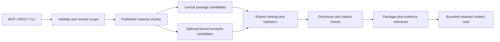

# Scoped corpus retrieval and semantic search

Date: 2026-09-20
Last aligned: 2026-09-23, main `52742d998e07dc21415444629c710c9bbf55b8cd`.
Status: approved design; scoped lexical implementation is in progress. Production activation requires the reviewed incremental migration and deployment gates.

## Outcome and scope

Let a person or agent search all eligible published text, restrict the search to a source or workspace, inspect the relevant passage and follow an exact citation to retained context. The same retrieval rules apply to plain text, native-text PDFs, supported Office/document extractions, scanned PDFs, supported mixed PDFs, JPEG/PNG OCR and interactive Visio text. OCR is an input method, not a separate search product. This adds retrieval over these existing inputs; it does not add or repair their extraction capabilities.

Deliver two independently useful increments:

1. Scoped corpus search and bounded passage reading, with verified citations and the existing local search foundation.
2. A selected local semantic embedding model, evaluated against that foundation and introduced through a recoverable index transition.

The first observable result is a public synthetic plain-text document and a retained OCR document queried through MCP, REST and CLI: each returns the relevant passage within the requested scope, original identity, revision and supported location, and each citation can retrieve bounded context. An unrelated source containing the same terms must remain excluded.

Keep native SQL Server, SQL Full-Text and embedded USearch. This follows the current native architecture; the lexical increment adds only a Full-Text index on retained chunks. Preserve the existing pipeline and processor ownership. No new extractors, OCR tuning, model acquisitions, ASR, reranker, answer generator, autonomous memory writes, source rescans, source-original reads, dashboard redesign or manual regeneration belongs to this delivery. Existing specialised code/symbol queries remain unchanged. Already published code text can participate under the same corpus policy, without replacing symbol search or indexing additional code facts.

## Evidence and dependency boundary

This review used main `52742d998e07dc21415444629c710c9bbf55b8cd`, equal to freshly fetched `origin/main` on 2026-09-23. The earlier OCR worktree is no longer an integration dependency. Changes since the original analysis include offline English OCR (`6f27e69`), interactive Visio (`eab15ca`), automatic document activation (`90887ec`), source-scan wakeup (`770be04`), obsolete VSDX registration retirement (`8293735`), logical document publication and image/Office coverage (`d950f22`), the original retrieval plans (`270c945`), and native repository consolidation (`52742d9`). The maintained design and plans now live in `docs/design/`; do not recreate removed planning trees or plugin directories.

Code and retained delivery records establish the baseline below. This documentation review ran no runtime, OCR, model, database or live acceptance checks; existing delivery records retain their original scope and limitations.

| Observed implementation | Consequence for this design |
| --- | --- |
| `KnowledgeQueryService.SearchAsync` merges retained `ISearchService` hits with knowledge-store rows. | `knowledge.search` already searches corpus snippets. Preserve that mixed-search behaviour; the gap is scope, citations and follow-up context. |
| `SearchQueryValidator` rejects workspace scope, cwd, root name and nonempty filters. | Add explicit closed scope semantics; never silently broaden a requested scope. |
| `SqlFullTextSearch` ranks `Artifacts.SearchText` and then returns vector/chunk rows. | Passage selection needs chunk-level matching. A term late in a document must not return an unrelated first chunk. |
| `TextChunker` produces bounded 2,048 UTF-16-unit chunks with offsets. | Reuse these chunks for the first increment; do not couple retrieval delivery to rechunking the corpus. |
| `SearchHit` has identity, revision, title, snippet, score and explanations. | Add a richer corpus response without breaking existing result envelopes. |
| `WebHostComposition` registers `DeterministicTokenHashEmbeddingProvider`. | The current ANN path is a model-free baseline, not learned semantic retrieval. |
| `UsearchNearestNeighbourQuery` embeds before `UsearchAnnIndex` selects the active generation. | Query embedding and ANN generation need one immutable binding before models can change. |
| The generation builder rejects mixed model fingerprints; publication validates complete membership. | A model transition is more than swapping dependency-injection registration. |
| `SqlStageTransitionStore.PublishDocumentIfApplicableAsync` selects an exact completed branch under a serialisable Publish transaction and locks `DocumentPublications` by physical owner revision. Search guards both `OriginKind` 2 and 3. | Consume the selected publication; never reconstruct selection from the newest timestamp or expose every internal child. |
| `OoxmlStructuralTextProcessor` emits one logical text child; `SqlRetainedTextRegistrationStore` allows that specifically bound Office result up to 200 MiB while ordinary UTF-8 remains 16 MiB. | Preserve one Office identity and implement bounded SQL passage reads without materialising a whole document per hit. |
| `DocumentProvenance` v1 now carries Visio identities and image source geometry as well as PDF/OCR spans; public `SearchHit` still has no location fields. | Map concrete retained fields into the new corpus responses. No extraction change or new metadata schema is needed merely to expose citations. |
| Vector enumeration in `SqlPipelineStore`, `SqlStageTransitionStore` and `SqlSourceDeletionStore` is broader than the selected searchable document set. | Reuse identities/checksums, but do not treat current `ReadEligibleVectorsAsync` as the final published-chunk/profile selector for the semantic upgrade. |

### Actual content and location coverage

| Published content | Retained evidence to consume | Retrieval boundary |
| --- | --- | --- |
| Ordinary UTF-8 and accepted Office text | Canonical text/chunk offsets and original owner identity; Office emits one logical DOCX/XLSX/PPTX result. | Verified spans; canonical lines only when calculated within a declared bounded read. Do not invent original pages, sheets, cells or slides from textual headings. |
| Native PDF and page-level English PDF OCR | `DocumentProvenance` v1 page ranges, extraction method and optional OCR block geometry/kind/orientation. | Pages containing native text plus separate scanned regions are not currently region-OCRed. Mixed-PDF acceptance covers native and scanned content on separate pages. |
| Supported single-frame JPEG/PNG OCR | One image page with block spans plus optional `SourceWidth`, `SourceHeight`, `SourceTransform` and orientation. | Return an image location and preserve the recorded coordinate frame; page index zero is an internal identity, not a claim that the original image is a paginated PDF. |
| Interactive Visio | Page index plus `VisioPageId`/`IsBackground`; block `ShapeId`, `ParentShapeId`, `MasterId`, `MasterShapeId` and optional connector/arrow fields. | Preserve page-scoped shape identity. No fabricated shape geometry, inferred connector meaning or unrestricted copy of the arbitrary `Data` dictionary. |
| Selected media metadata fallback | The accepted `OriginKind` 3 logical text result under its original owner. | Label as metadata-derived text, not OCR/transcription. A selected higher-priority extraction replaces it. |

`Kind=table` is a block classification, not a typed row/column/cell citation schema. Current provenance also has no general confidence/uncertainty field. Expose only fields actually present and validated; missing cell/confidence fields do not require a new extractor in this phase. Keep structured values bounded and secret-filtered.

The [current architecture](../architecture.md), [coverage matrix](../file-type-coverage.md), [OCR evidence](../operations/2026-09-20-english-ocr-live-delivery.md), [practical assessment](../operations/2026-09-20-english-ocr-practical-assessment.md) and [Visio evidence](../operations/2026-09-20-interactive-visio-delivery.md) retain the distinction between delivered paths and remaining gaps. Repeated-text fidelity, same-page native/scanned regions and supported retry of terminal failed OCR remain extraction/operations work. Exposing retained page/shape/image locations is owned by this retrieval increment; full typed table-cell provenance is not promised by it.

Before implementation, compare the then-current main with this pinned baseline and review only further relevant changes. Do not wait for the already merged OCR task or replay completed acquisition/deployment work. The exact embedding model/runtime decision and semantic transaction amendment remain future gates.

## Alternatives and decision

Extending the mixed memory/source response in `knowledge.search` would change what existing consumers receive and leave passage follow-up awkward. Replacing the whole search stack or adding a new vector database would add migration cost without addressing an established need. Choose two additive corpus operations backed by shared application retrieval, SQL eligibility and existing local infrastructure. Keep `knowledge.search`, `corpus.query`, code queries and `/api/search` compatible.

The first increment uses scoped lexical passage retrieval for the new operations, explicitly labelled `lexical`. Existing hybrid callers retain their current behaviour. This avoids pretending that post-filtering a small global ANN result implements reliable scoped search. The second increment adds actual semantic ranking to the same corpus contract, not another OCR-specific route.

## Public contracts

| Surface | Search | Read a cited passage |
| --- | --- | --- |
| MCP | `corpus.search` | `corpus.read` |
| REST | `POST /api/v1/corpus/search` | `POST /api/v1/corpus/read` |
| CLI | `FluxKnowledge.Cli corpus search` | `FluxKnowledge.Cli corpus read` |

CLI verbs extend the existing `NativeV1Command` dispatch, selected by the top-level `corpus` verb in `Program.cs`; there is no additional `native` verb. All surfaces use the same application requests and native envelopes, existing direct-loopback restrictions, secret disclosure checks, cancellation and bounded read retries. These are read operations and require no mutation confirmation. They do not invoke OCR, scans, model acquisition or indexing. Update discovery/authority descriptions and closed operation allowlists together; leave the nine existing operations' meaning intact.

Proposed application contracts (new types; names are agreed interfaces for the implementation plans):

```csharp
public sealed record CorpusSearchRequest(
    string Query, int Limit, string Scope, Guid? RootId, string? Cwd);
public sealed record CorpusReadRequest(string EvidenceRef, int ContextCharacters);
public interface ICorpusRetrievalService
{
    ValueTask<CorpusSearchResponse> SearchAsync(CorpusSearchRequest request, CancellationToken token);
    ValueTask<CorpusPassageResponse> ReadAsync(CorpusReadRequest request, CancellationToken token);
}
```

Wire request fields are `query`, `limit`, `scope`, `root_id`, `cwd`, `evidence_ref` and `context_characters` as applicable. Search query is trimmed/FormC-normalised, 1–2,048 UTF-16 units; limit is 1–20, default 10. Reject unknown fields and incompatible combinations. Read context is 0–4,096 UTF-16 units in total beyond the cited span, default 1,024. Token length is at most 2,048 characters. Requests remain within the existing 32 KiB ceiling. Add a 256 KiB UTF-8 response ceiling for these two operations, beneath the existing native maximum; do not truncate JSON or citations to fit it. Refuse an over-limit result with a named bounded error.

Search response fields: `results`, `resolved_scope`, `retrieval_mode`, `semantic_status`, nullable `index_generation`, and `warnings`. Each hit contains an opaque `evidence_ref`, original `source_identity`, nullable `root_id`, nullable owner source revision ID, processing pipeline record ID/revision, title, chunk ID/hash, canonical text span, exact passage, citation locations, extraction method where known, and rank explanation. Eligible unrooted records have no invented source-root/owner revision; their exact source identity and pipeline record/revision remain mandatory and bind the reference. Passage length is at most 1,024 UTF-16 units; keep offsets valid at surrogate boundaries. No generated summaries. Omit unavailable typed locations rather than fabricating them. A score/rank is not an extraction-confidence value.

Read response contains the same identity/revision/citation fields, the exact returned canonical text and its start/length, and whether context was bounded by the document end or requested size. It returns no neighbouring document. References are locators, not authorisation tokens or arbitrary file paths. Returned source text/path/title and context all pass the existing disclosure policy; if withholding occurs, never alter text while retaining offsets that imply it is an exact canonical substring.

### Scope rules

- `all`: no `root_id` or `cwd`; includes all eligible published corpus records, including existing eligible unrooted records. It does not include knowledge-store notes/claims.
- `root`: exactly one current registered `root_id`; no cwd. Resolve and filter through retained ownership, including the physical document owner of an internal extraction revision.
- `workspace`: exactly one absolute canonical Windows cwd; no root ID. Resolve registered roots and retained owner paths contained within that directory using case-insensitive component boundaries. A root containing cwd is intersected with cwd, never included wholesale. Include registered roots beneath cwd, including nested and sibling roots; return the resolved roots/boundary and preserve each record's root/owner identity. Registration rejects overlaps with protected system locations and deduplicates exact canonical paths; it does not exclude ancestor/descendant registrations. Use pure path syntax/component checks against stored canonical paths, rejecting UNC, relative/device/wildcard paths. Do not invoke `SourceRootPathPolicy.ValidateAndCanonicalise` for a query: that registration path probes directories, handles, volumes and enumeration. Retrieval must work from retained state when originals are unavailable; unresolved aliases fail closed rather than broadening scope.
- A missing/deleting root or workspace without registered coverage returns `scope-unavailable`, not all-source results. A valid scope with no matches returns an empty success. Paused sources remain readable under existing policy; deleting/suppressed records do not.

Root IDs are stable selectors; display names are not identifiers. No arbitrary SQL/filter language, root-name matching or automatic fallback from workspace to all. Future file-type filters require a contract extension and candidate-stage tests.

## Retrieval and citation architecture



### Eligibility before ranking and again before disclosure

Create one reusable SQL eligibility definition for these retrieval paths. A candidate must be associated with completed Publish, accepted document publication when applicable, an unsuppressed/non-deleted current owner and processing revision, valid chunk/artifact binding and content hash, and a root not deleting. Handle existing non-document retained records and eligible unrooted pipeline records explicitly. Internal `OriginKind` 2 (document/Office text) and 3 (metadata text) require an exact selected `DocumentPublications` row. Its key is the physical owner revision; retain both that GUID and the selected processing pipeline ID/revision. Read the selector rather than choosing a maximum branch timestamp, a maximum pipeline revision or every child with a parent. Unrooted records retain their distinct current-revision policy.

The existing selector gives non-metadata results priority over kind 3, then fences equal-priority successors by branch creation/identity and pipeline revision. A later metadata result cannot replace selected OCR. Preserve the last good selected result while a successor is pending or a paused root prevents publication. Ordinary archive members (`OriginKind` 1) retain independent identities: Office/image publication must not suppress them or collapse every member under a container filename. Keep the specialised PDF/VSDX retirement behaviour in the publication path; search/read never mutate publication or suppression records.

Apply scope and lifecycle predicates before the candidate limit, then recheck before final text/reference disclosure. For reads, validate the reference and repeat the same SQL/lifecycle checks. A deletion committed before that final read must be excluded; a result already authorised/read before a concurrent deletion cannot be retroactively recalled. Never serve from pending OCR/result tables or source originals. If acceptance changes during the request, discard the affected hit; a read returns `evidence-stale` instead of substituting a successor's text. No transaction spans inference or network response writing.

### Relevant passages

Add a SQL Full-Text index on existing `TextChunks.Content` using its unique integer key and the existing catalogue. Follow the repository's nontransactional Full-Text migration pattern. Keep the artefact index until compatibility no longer needs it; no new text copy or per-page table is required. Select candidates from chunk Full-Text matches joined to eligible owner/publication and scope before TOP. Avoid the Full-Text engine's global `top_n_by_rank` shortcut for scoped queries. Do not claim a Full-Text population has completed from migration success alone; readiness must distinguish unavailable/populating from a genuine no-match result.

A 200 MiB Office result can contain far more chunks than a short PDF. Project only bounded candidate chunks, immutable identities/hashes and relevant retained metadata. Passage/context reads must use bounded SQL text slices or adjacent chunks from the same canonical artefact, not load `Artifacts.SearchText` in full, calculate a whole-document hash on each request, or reopen source files. If SQL substring operations are used, their collation/counting must match .NET UTF-16 offsets, including surrogate pairs; otherwise assemble bounded canonical chunks and verify lengths. Optional canonical line numbers may be omitted when computing them would require an unbounded prefix read. These are read-path bounds, not lower extraction limits or a request to rechunk/reprocess existing sources.

Use SQL Full-Text for ordinary language terms. Preserve literal matching for numbers/identifiers/punctuation through a bounded parameterised exact-phrase branch over the same eligible chunks, with ordinal application verification before emitting an exact-match explanation. Quote/escape Full-Text expressions separately from SQL parameters; never execute user-supplied Full-Text syntax. Exact identifiers present in a chunk must be retrievable without the query string being interpreted as operators. Test the chosen treatment against the installed SQL word breaker, not a string-only mock.

Rank exact evidence ahead of non-exact matches; retain stable tie-breaks and shared reciprocal-rank fusion when semantic candidates exist. Return at most two passages per logical published document, filling from further eligible candidates within a declared 200-candidate budget. Report `candidate-budget-reached` whenever budget exhaustion can affect completeness, including document diversity, ordinal exact-match rejection, lifecycle rechecks or disclosure withholding. Test case/accent-insensitive SQL near-matches exhausting the budget before a genuine ordinal identifier match; do not label the bounded result exhaustive or a definitive no-match. Build snippets around the best verified match within the chosen chunk; semantic-only hits use bounded chunk context without invented highlights. An adversarial long document with the only match near its end is a mandatory test.

### Location semantics and reference lifetime

Offsets and lengths refer to canonical normalised retained text in UTF-16 units, matching the existing chunker. They are not byte offsets into source files. Record the canonical artefact hash and chunk hash. `NormaliseTextStageWorker` calls `DocumentOcrProvenance.NormaliseTextAndMetadata`; `CanonicalIndexStageWorker` carries its metadata forward. Read that canonical artefact, not the pre-normalisation Extract metadata. Intersect citation spans with page/block ranges. A span crossing pages returns multiple bounded locations or is clipped to a valid boundary; never label all text with the first page. Display actual document pages one-based while preserving stored zero-based indices; keep `VisioPageId` distinct and label image locations as images.

Plain text always receives verified canonical spans. Add canonical line ranges only when computed within the retained-read budget; do not call those original-file line numbers. Use the coverage table's existing page/shape/image fields only where they intersect the exact passage. Missing retained location metadata yields `location-unavailable`, with valid text-span evidence. Unsupported metadata versions, invalid spans or geometry yield a named provenance warning and span-only citation, never a guessed page, shape or coordinate conversion. Preserve source dimensions, transform and orientation together when presenting image bounds; do not relabel rotated raster coordinates as original-file coordinates without a verified mapping. The current schema has no typed table-cell or confidence contract, so those fields are omitted rather than inferred.

Use a dedicated ASP.NET Data Protection purpose `FluxKnowledge.CorpusEvidence/v1`, following the existing cursor codec pattern. Bind owner and processing identity, canonical artefact ID/hash, chunk ID/hash and cited span. References contain no raw query or source text. They have no wall-clock expiry in v1: lifecycle/current-publication checks define validity, and key loss yields a safe invalid-reference response requiring a fresh search. Ordinary unrelated index rebuilds must not invalidate a reference to unchanged accepted text. Generation may be reported as diagnostic evidence but does not confer read authority. Rotation/successor publication, deletion, tampering, unknown version and changed hashes fail closed.

## Semantic increment: selected model and safe transition

Do not pick a model name from assumptions or download for this planning task. The implementation plan begins with a bounded cache-first model/runtime decision, using verified central inventory and relevant existing provider cache records. Select one supported local embedding route and record exact model/tokenizer/pooling/normalisation/query-versus-document prompts, dimensions, token limits and immutable fingerprints. A missing artifact, adoption, new runtime or acquisition remains a separately presented approval decision. No provider-name loader, implicit download, fallback drive or silent CPU/GPU substitution is allowed. Ordinary tests remain model-free.

Use the existing scheduler priorities for a GPU route: interactive query embedding precedes background document embedding, with OCR capacity still accounted for. Reuse admission/receipt/owned-process patterns; the current PaddleOCR executor and `NativeGoLiveRuntimeOptions` local-OCR readiness checks are not generic embedding support. Add a separately validated embedding route without repurposing OCR manifests, flags, deletion ownership or runtime state. Do not run unadmitted inference or hold an Extract/SQL lease while waiting. Bound query waiting with an explicit deadline; return lexical results with `semantic_status=busy/unavailable` on safe refusal. Do not evict/kill OCR to answer a query. Only a measured, explicitly selected CPU route may bypass GPU admission; label actual execution placement.

### Model/index binding

Introduce a search-generation lease capturing generation ID, immutable model fingerprint, dimensions, metric and provider binding before query embedding. The first semantic increment supports cosine (`cos`) only, matching existing USearch configuration and scoped exact ranking; reject a different metric during profile admission. Search that exact generation; do not reread an unrelated active pointer after creating the vector. Hold the relevant model lease and ANN handle until completion, and preserve referenced generation files. In-flight old-generation searches can complete if text remains eligible; lifecycle hydration still applies. Same dimensions with different model fingerprints are incompatible. Malformed/nonfinite vectors or unknown bindings refuse semantic work, retaining declared lexical results.

Scoped semantic correctness must not depend on filtering global top-k. For the first semantic increment, rank the complete scoped eligible vector set by cosine similarity up to a configurable, tested bound initially set to 10,000 vectors. Resolve/count against the captured generation and scope; when the bound is exceeded, use lexical-only with `semantic_status=scope-capacity-exceeded`. Do not claim semantic no-match from a truncated candidate pool. Unscoped queries can use the generation-bound existing ANN. This is a bounded initial implementation; partitioned/filtered ANN is deferred until measured scope sizes justify it.

### Candidate generation and publication

Retain immutable model-specific vectors alongside the active representation. Introduce a durable embedding-upgrade operation and target membership keyed to the selected profile and exact canonical chunk/hash/source revision. Extend selection/build APIs to request one profile; never weaken the mixed-fingerprint check. Preserve the existing vector payload/checksum distinction. Current `ReadEligibleVectorsAsync` implementations are broader storage enumerators, not the new published-search set: the upgrade selector must respect completed Publish, selected kind 2/3 ownership, suppression/deletion and profile identity explicitly. Do not rewrite terminal extraction jobs or rerun OCR just to embed retained text.

The upgrade runs in bounded resumable batches over retained published chunks while current search and normal publication continue. Record target profile, state, source-set digest, progress, generation IDs and reason codes, not private text. Equal retries reuse the same chunk/profile vector; conflicting values fail. Source replacement/deletion removes eligibility and stale completion cannot reintroduce it. Keep lifecycle/upgrade exclusion in the existing SQL authority, not an in-memory flag.

Before activation, catch up changed published chunks, build/reopen/validate a single-profile candidate, and compare its membership to the current eligible published chunk set under the same serialised publication fence used for the pointer update. If the set changed, rebuild the delta; three unsuccessful activation comparisons leave an explicit pending/retryable operation rather than spinning. No long inference/index-build work occurs while that fence is held.

Switch active profile and generation atomically. Every normal Embed/Publish path must capture/recheck the profile binding. Normal Publish builds its candidate before its final transaction selects a new document publication; the concrete transaction design must therefore account for that owning transition's prospective publication set as well as the last committed set. A naive published-only pre-build must not omit or strand the new result. Only the fenced owning Publish may make that prospective result visible; upgrade/background work cannot publish it independently. Work carrying the old profile cannot move the pointer backwards after activation; durable profile-specific embedding continuation supplies the newly required vectors before its publication completes. Keep completed source/extraction records immutable. This continuation is part of the semantic increment, not a later follow-up.

Use an additive schema migration for upgrade state and any profile/publication fence required by the implementation. Before implementation of this high-risk portion, an independent review must examine the exact schema and transaction design with the merged OCR deletion path. The plan requires repeatable generated-SQL tests for each invariant below, not a claim that existing snapshot code already supplies them.

### Rollback and recovery

Before activation, abandon or pause the candidate operation without changing the active profile/generation. Preserve reusable verified models and valid candidate evidence. After activation, immediately disable semantic querying if needed; scoped lexical search remains independent of embedding health. A pointer to an old generation is not a complete rollback once content has changed. Rebuild a deterministic-profile generation from all currently eligible retained chunks, catch up and validate it, then use the same atomic profile/generation switch. Do not restore deleted/superseded content or rewind publication ownership. Reuse deterministic vectors where valid and compute missing ones without models.

SQL membership/profile state is canonical for derived-index recovery. Recovery, deletion survivor rebuilds and ordinary Publish must all select the intended profile and honour the active binding. A crash after placement but before activation leaves the old pointer; after activation, restart resolves the new binding. Rollback of application binaries is a separate reviewed operational action and must account for older binaries' inability to understand multiple profiles; do not promise that additive schema alone makes it safe.

## Acceptance and evaluation

| ID | Required result |
| --- | --- |
| R1 | Plain text, native PDF, scanned PDF and PDFs with native/scanned content on separate pages use the same operations. Include DOCX/XLSX/PPTX logical documents, JPEG/PNG OCR, Visio, metadata fallback and a published code-text regression. No new extraction is invoked. |
| R2 | Root/workspace boundaries exclude stronger out-of-scope matches before limits; sibling paths with common prefixes remain distinct; unknown scope cannot broaden. |
| R3 | Long documents return the matching passage; exact names, identifiers and critical values remain searchable; source diversity does not disguise a candidate cap. |
| R4 | Every returned span equals the corresponding canonical UTF-16 substring; normalisation, surrogate pairs, page crossing, page-scoped Visio shapes, image rotation/dimensions and absent/unsupported metadata have explicit coverage. Read bounds hold for a large Office artefact. |
| R5 | Pending/unaccepted/suppressed/deleting content never becomes searchable; last-good publication remains readable until valid replacement; stale reference cannot resolve a different revision. |
| R6 | MCP, REST and CLI return equivalent bounded data/errors; loopback, secret-withholding and existing knowledge/code contracts remain intact. |
| R7 | Same-profile query/index binding survives switch/restart; same-dimension/different-model vectors are refused; model hits/misses/concurrency perform zero implicit transfers. |
| R8 | Upgrade retries, deletion, normal publication and rollback preserve current eligible content without duplicate/conflicting vectors or pointer regression. Cover metadata-to-OCR replacement, Office owner selection, independent archive members and the normal Publish prospective-set race. |
| R9 | Scoped semantics ranks the full eligible set within its bound; excess capacity and GPU busy/unavailable return honest lexical degradation, not silent empty/partial semantic results. |
| R10 | Learned embeddings demonstrate usefulness beyond token hashing on ordinary text as well as OCR, without regressing exact evidence retrieval or provenance. |

For R10, freeze approximately 24 independently specified questions before reviewing rankings: at least eight plain/Office text, eight native PDF and eight scanned/mixed PDF questions, spanning paraphrases, exact identifiers/numbers, hard negatives and workspace distractors. This is a bounded private-use acceptance set, not a general model benchmark. Keep private originals, questions and predictions outside Git; public tests use synthetic content. Reuse the OCR task's independently verified passages where appropriate without editing its expectations.

Before ranking, record whether each expected source passage actually exists in the accepted canonical extraction. Report missing/repeated or meaning-changing extraction separately from retrieval misses, retaining the original expectations; do not manufacture a semantic success for absent text. Evaluate retrieval benefit on the declared retained-evidence subset and disclose upstream exclusions alongside total source-to-result failures. Image/Visio and metadata-fallback correctness fixtures supplement this bounded ranking set without starting another OCR benchmark campaign.

Report Recall@5 and reciprocal rank separately by input class and query type, plus citation validity, empty/degraded outcomes and warm/cold p50/p95 latency. Mandatory correctness gates are zero scope/lifecycle leakage, zero wrong-reference resolution and all designated exact-value/identifier checks passing. Recommend activation only when a majority of predeclared paraphrase misses from the lexical/token-hash baseline are recovered in top five, no input class loses Recall@5, and combined exact-priority ranking retains the designated exact checks. If the bounded set cannot establish benefit, keep lexical/default retrieval and report the measured decision; do not tune repeatedly against the same questions. Provisional interactive target: warm p95 under two seconds, semantic wait deadline two seconds, with explicitly labelled lexical degradation beyond that budget. Validate this against the selected runtime/hardware before activation; a changed performance target is a recorded product decision.

## Implementation, review and authority

Implementation plans:

- [Scoped search and passage reading](scoped-corpus-retrieval-plan.md).
- [Semantic embeddings and index transition](semantic-corpus-retrieval-plan.md).

One implementation owner should deliver each coherent increment. Independently review the high-risk model/index migration design before implementation and the complete resulting change before operational activation. This planning task does not deploy, migrate, restart, rescan, acquire models or alter live data. Production actions require explicit authority in the implementing conversation, concrete reviewed targets/evidence/rollback, and the repository's incremental updater. The OCR changes are already on main; there is no outstanding cross-task merge gate. Feature closeout must use `scripts/dev/complete-feature.ps1`, whose default native path verifies and integrates without deploying. Model/runtime and concrete semantic migration decisions remain explicit future gates.

Effort checkpoint: after two meaningful implementation batches, verify an executable plain-text search/read path through a real interface exists. If not, stop broadening the work, identify the blocker and reduce to that first result. Add page metadata and other transports in the next coherent batch, rather than completing an entire model framework first.

### Planning review record

An independent Astra review on 2026-09-20 found no blocking planning contradictions after inspecting the three documents, roadmap/architecture additions and relevant current code. Its two clarifications are incorporated: nullable owner identity for eligible unrooted records, and honest candidate-budget exhaustion after ordinal/disclosure filtering. Self-review also fixed the actual CLI prefix and restricted the initial embedding metric to cosine. Local links, document hygiene and the docs-only diff were checked. This approves the planning foundation only; the concrete semantic schema/locking design, executable checks and operational gates remain future work.

An independent Astra alignment review on 2026-09-23 approved the documentation changes against main `52742d998e07dc21415444629c710c9bbf55b8cd` after correcting the registered-root overlap assumption: nested registrations remain supported and tested; registration's overlap restriction concerns protected system locations. No blocking findings remained for publication priority, prospective Publish membership, bounded Office reads, concrete provenance fields or the separation of extraction gaps from retrieval evaluation. The native repository contract, maintained Markdown links, document hygiene and docs-only diff were checked. This is planning alignment only, with no new runtime acceptance or implementation progress; the concrete semantic migration review and operational gates remain outstanding.
