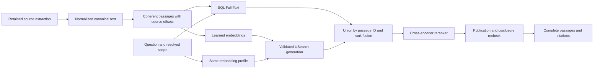

# Hybrid passage retrieval design

Date: 25 September 2026. Source baseline: `1f4aa16`.
Status: proposed architecture and implementation specification; no runtime change.
Companion: [implementation plan](hybrid-passage-retrieval-plan.md).

## Decision and scope

Adopt the established passage-based hybrid retrieval and cross-encoder reranking
pattern. Keep SQL Server as canonical storage, SQL Full-Text for lexical
retrieval and USearch for the derived vector index. Use one passage-search engine
for `corpus.search` and the source portion of `knowledge.search`; preserve notes
and claims as their separate content class. Adapt `/api/search` to this engine
as well, eliminating two competing source-ranking implementations.

The user selected **English initially** and explicitly declared existing indexed
text disposable. Perform a controlled clean rebuild at deployment. Do not build
an old-chunk compatibility layer, migrate old vectors, retain old evidence
references, dual-write models or implement a zero-downtime model transition.
Source originals, model files and unrelated knowledge records are outside the
search reset. This design permits a search maintenance window. Exact operational
targets and execution still require deployment authority.

The delivered capability is: an English question finds relevant, current source
passages through words and learned meaning, a reranker orders the shortlist,
and the response returns those complete passages with verifiable citations.
Architecture choice is settled; bounded acceptance verifies the implementation
and configuration. It is not an open-ended model survey.

Excluded: new OCR/extractors, Arabic acceptance, generated answers, agentic query
rewriting, graph retrieval, model training, remote inference, a replacement
database, new dashboard screens and manual regeneration. Existing specialised
code queries and knowledge note/claim search retain their purpose.

## Evidence and alternatives

The [BGE pilot](../operations/2026-09-24-bge-m3-onnx-evaluation.md) found the
relevant document for 21/24 answer-present questions but the answer passage for
11/24. Dense retrieval reached 15/24; the evaluated hybrid reached 14/24 and
displaced correct lexical spans. These experiments used different dense windows
and lexical chunks. They do not prove that a model alone fixes passage selection.
The [later investigation](../operations/2026-09-24-scoped-lexical-ranking-investigation.md)
also identified excerpt losses and rejected local rules that regressed DOCX.

| Option | Assessment |
| --- | --- |
| Continue modifying lexical excerpt heuristics | Leaves the representation and paraphrase problems; rejected as the primary direction. |
| Shared coherent passages, lexical+dense retrieval, cross-encoder reranking | Selected. Directly addresses candidate recall, ordering and excerpt loss with established components. |
| Replace the storage/search platform or adopt a larger retrieval framework | No evidence that this fixes the observed failures; adds migration and operational work. |

Research basis, checked 25 September 2026:

- [Sentence Transformers retrieve and rerank](https://www.sbert.net/examples/sentence_transformer/applications/retrieve_rerank/README.html): a fast candidate stage followed by joint query/passage scoring.
- [Microsoft chunking guidance](https://learn.microsoft.com/en-us/azure/search/vector-search-how-to-chunk-documents): use document boundaries and overlap, with measured sizes. Our smaller initial passage bound preserves the existing response budget.
- [Microsoft hybrid rank fusion](https://learn.microsoft.com/azure/search/hybrid-search-ranking): combine ranks rather than incomparable raw lexical and vector scores.
- [USearch](https://github.com/unum-cloud/USearch): vector indexing remains separate from embedding inference.
- [BGE reranker](https://huggingface.co/BAAI/bge-reranker-v2-m3): joint query/passage relevance scoring, separate from embedding generation.
- [ONNX Runtime DirectML constraints](https://onnxruntime.ai/docs/execution-providers/DirectML-ExecutionProvider.html): explicitly configure provider concurrency and account for resident sessions when sharing GPU capacity.

These sources justify the pattern, not an expected Flux accuracy percentage.

## End-to-end behaviour

The existing `Identify -> Extract -> Normalise -> CanonicalIndex -> Embed ->
Publish` pipeline remains. CanonicalIndex produces useful passages instead of
arbitrary storage cuts. Embed is bounded, resumable and uses the selected learned
profile. Publish selects the exact document revision and activates a validated
generation. New content waits if background embedding cannot execute; previously
published text remains searchable. No new asynchronous publication subsystem is
needed. Query-time model refusal returns honest lexical results.

## Passage contract

Replace `TextChunker` with `PassageBuilder`, retaining `TextChunks` as the SQL
passage table and integer Full-Text key. Every passage has one contiguous span
of the canonical text: artifact ID/hash, source revision, ordinal, start, length,
content and content hash. Offsets remain UTF-16, never original-file byte offsets.
Overlapping passages are allowed; duplicate `(artifact, policy, start, length)`
spans are not. Content must equal the canonical slice byte-for-byte after UTF-8
encoding. Corpus epoch and passage-policy fingerprint identify the interpretation.

Initial policy, configurable and recorded before acceptance:

| Setting | Initial value / rule |
| --- | --- |
| Passage target | 192 tokens under the selected embedding tokenizer |
| Hard body limits | 256 embedding tokens **and** 1,024 UTF-16 units; both must pass |
| Boundaries | Retained structural boundaries, paragraphs, sentences, then words; Unicode-safe splitting only for an oversized indivisible token |
| Overlap | Previous complete sentence(s), up to 32 embedding tokens and 128 UTF-16 units; strict forward progress |
| Context header | Optional source title and retained heading path, at most 32 embedding tokens; stored separately from the cited body |
| Public passage | Entire body, never a query-dependent crop |

Keep a paragraph or table row together when it fits. Current Office extraction
does not expose a general typed table/heading tree: use only explicit retained
text boundaries and validated metadata, and fall back to sentences/lines. Never
invent cells, slide numbers, hierarchy or inferred relationships. A very large
row/block is split with continuation context and its existing provenance. Avoid
joining unrelated Visio shapes merely because their text is adjacent; use
retained page/shape boundaries where available. Page boundaries may be crossed
only when canonical text is contiguous, with every affected location returned.

The same `header + body` input is used for lexical candidate search, dense
embedding and reranking. Exact-match priority requires an ordinal match in the
**body**. Metadata-only matches may discover a passage but are labelled in its
explanation; a header is never quoted as part of the contiguous evidence span.
Store `SearchText`, `ContextHeader` and `SearchInputHash` alongside the body;
Full-Text indexes `SearchText`. Bound these added fields and apply disclosure
checks to the full model/search input, not just the returned body.

Read context using bounded SQL slices of canonical `Artifacts.SearchText` with
a non-SC binary collation and tested UTF-16 counting. Remove the existing
assumption that adjacent chunk ordinals concatenate without overlap. Preserve
the complete-line disclosure guard, 16 Ki-unit detector budget, 4,096-unit
additional read-context limit and 256 KiB response ceiling. Never materialise
a whole 200 MiB Office result for a search/read request. Construction itself uses
streamed retained text or bounded slices with carry-over, not a new whole-document
copy per passage.

## Retrieval and ranking

1. Normalise the query and resolve the existing all/root/workspace scope. Unknown
   scope fails closed. Capture the epoch, profile and generation binding before
   query embedding. Use one shared SQL eligibility definition for selected
   publications, current unrooted published revisions, suppression and deletion.
2. Retrieve up to 100 lexical candidates. Scope and eligibility apply before
   TOP; use SQL Full-Text and the existing parameterised ordinal-body branch.
   English LCID 1033 remains. Full-Text population status is explicit.
3. Retrieve up to 100 dense candidates with the same profile and passage IDs.
   All-corpus search uses the captured USearch handle. For a root/workspace with
   at most 10,000 eligible vectors, calculate cosine over the entire scoped set
   using that generation's SQL membership. Above that bound, declare semantic
   scope-capacity refusal and use lexical retrieval. Do not post-filter a small
   global top-k and claim it implements scoped retrieval.
4. Union by passage ID, retaining both ranks; maximum 200 candidates. Apply
   reciprocal-rank fusion with constant 60 and equal initial channel weights.
   Never substitute another window from the same document or chunk.
5. Rerank the first 50 candidates ordered by `(ordinal body exact tier, fused
   rank, passage ID)`. Pass the entire query and each complete header/body pair
   to the cross-encoder. No model-side silent truncation. If the complete batch
   cannot fit, finish or validate, discard its partial scores and retain the
   deterministic fused order with a reason. Keep exact-body matches in their
   priority tier; within a tier use reranker score, then fused rank and ID.
6. Select up to the caller's limit, at most two passages per logical published
   document. Suppress near-duplicate spans only within that document when their
   intersection covers at least 80% of the shorter body, retaining the higher
   ranked passage. Record candidate/shortlist/diversity effects in evaluation.
7. Recheck current publication, source state, hashes, scope and disclosure before
   returning each complete body and evidence reference. Top up only from the
   already scored shortlist. A depleted shortlist is reported; no unbounded loop.

The numerical budgets are initial engineering choices, not universal constants.
They can change through ranking configuration without schema changes. Tokeniser,
passage policy or embedding changes require a clean corpus rebuild. Changing a
reranker or shortlist does not require re-embedding if input compatibility holds.

Preserve the current query bounds, corpus limit 1-20, search limit 1-50 and
knowledge limit 1-100. Knowledge requests at most 50 source hits from the shared
engine and fills the requested total from the existing source/note/claim merge;
it may return fewer when those pools are exhausted. This fixes the current outer
1-100 / inner 1-50 validation mismatch without reducing the public limit.
Knowledge results still interleave source hits with
notes/claims; their source content uses the complete selected passage. No new
claim is made about semantic note/claim search.

`corpus.search` retains its fields. `retrieval_mode` is `lexical` or `hybrid`;
`semantic_status` identifies ready/not-enabled/busy/unavailable/timeout/
scope-capacity-exceeded/query-too-long/index-updating/rebuilding. Reranking state is carried by stable
explanation/warning codes. Report candidate budget, shortlist depletion and
Full-Text population warnings. A timeout/refusal must never be labelled a
semantic no-match. Other response adapters retain their shapes and use the same
selected passage order; operational status records degraded reasons without
logging query text or private passages.

## Models and runtime

Proposed first configuration: existing pinned BGE-M3 ONNX embeddings and
`BAAI/bge-reranker-v2-m3`, a trained approximately 0.6B-parameter cross-encoder.
The reranker is a separate model, not another use of the embedding head. This
is a quality-capable starting configuration, not a claim that its size proves
superiority or that it has passed Flux acceptance. Do not choose a smaller model
solely to avoid GPU scheduling. Exact identities, runtime gaps and acquisition
boundaries are in [model candidates](semantic-model-candidates.md).

Use the existing .NET ONNX Runtime adapter boundary, with GPU execution through
the shared scheduler from the outset. The reranker's upstream pinned repository
does not supply an ONNX file: a reproducible export and reference-output parity
are an explicit prerequisite, with conversion tools and outputs retained in the
model store. Do not pretend this adapter is already available. If a supported
export cannot pass parity/provider checks, stop that adapter and present the
specific runtime alternative; do not silently substitute a smaller model.

CPU versus GPU is execution placement, not a choice between semantic and
non-semantic search. The BGE pilot measured warm query p95 about 109 ms on CPU
and 18 ms on GPU, with close numerical agreement. It did not measure a complete
50-passage reranker. Keep placement separate from embedding-space identity;
changing provider alone requires parity and performance validation, not reindexing.
Changed weights, tokenizer, formatting or material quantisation changes require
a new profile and rebuild. CPU execution of the same models is an optional
validated configuration, not an automatic second workload launched after timeout.

### Shared GPU admission and ownership

Reuse SQL-authoritative capacity slots, dispatch receipts, admission generations,
FIFO within lanes and recovery. Retain lane priority except for the bounded OCR
turn described below. `InteractiveRetrieval` already exists; background
embeddings use `DocumentIndexing`. Current handoff requires a source `ParentJob`,
and `PaddleOcrVlmAdmissionGate` only admits its fixed OCR runtime. Extend these
actual boundaries; merely adding a retrieval lane or a process-local semaphore
does not integrate search.

- Add a bounded interactive request owner with request ID, owning instance,
  deadline and terminal state. A mini-task has exactly one owner: pipeline job
  or interactive request. Existing job/revision fences remain mandatory for
  background work. Interactive tasks do not fabricate a document/job/revision.
- Persist ownership and receipts, not query or passage payloads. Inputs/results
  remain in bounded memory tied to the request and executor instance; dispatch
  to another instance refuses. A lost owner expires its request and never
  replays a private query on restart. Independently reconcile any reserved GPU
  capacity using proven executor termination; expiry is not release evidence.
- Replace the OCR-only gate with a shared allowlisted runtime gate using the
  **same physical GPU slot**. Dispatch OCR to its existing adapter and retrieval
  to its offline inference adapter. Use exclusive GPU execution across OCR
  and retrieval; no claim that measured peaks safely coexist on the 12 GiB card.
- Treat one foreground request's embedding, candidate selection and reranking
  as one bounded interactive execution under the existing batch ownership.
  Load after admission, unload the embedding session before loading the reranker,
  and dispose the remaining session before confirming capacity release. No SQL
  transaction spans inference or waiting. This first version retains no loaded
  model between requests/batches and adds no idle-residency state, compatible
  reuse protocol or resident-owner extension to the slot.
- Preserve result receipts, idempotency, trusted release evidence and uncertain
  capacity recovery. A completed calculation alone is not proof of release:
  the adapter must confirm native execution and model allocations are finished,
  using verified disposal or proven worker exit. If that cannot be established,
  retain the existing uncertain-capacity handling. Do not weaken these safeguards
  to compensate for the extra loading time.
- An active OCR page finishes normally. Background embedding batches start at
  four passages, with token/byte bounds and yielding between batches. Use existing
  status reporting for queue age, execution/loading/cleanup times and uncertain
  capacity; add the OCR turn counter/reason without a new scheduling subsystem.
- Start with two admitted/waiting interactive requests machine-wide, a two-second
  admission wait and ten-second overall search deadline. These are provisional
  limits, separate from the proposed two-second healthy full-search p95 target.
  Include per-request model loads/unloads in that end-to-end measurement, and
  distinguish first process start from later requests. Preloaded microbenchmarks
  are diagnostic only and cannot satisfy the baseline's full-search target.

Start lexical work independently. Admission refusal/deadline returns lexical or
fused results with the appropriate reason. Cancellation, client disconnect or
fallback never releases capacity while native execution or residency persists;
late outputs cannot change the response. On shutdown, observe native execution
and reconcile ownership. Apply DirectML's sequential-session requirements.
The scheduler extension is a concurrency review gate, not a new scheduler.

### OCR turns during sustained search traffic

Use one bounded exception in the existing admission selector, initially
`MaxSearchBatchesBeforeOcr = 3`. Preserve existing lane assignments: document OCR
currently enters `DocumentIndexing`, also used for background embeddings. Identify
OCR by its validated allowlisted runtime/workload identity, never by assuming
that all OCR uses `ImageOcr` or all `DocumentIndexing` work is embedding work.
While a valid OCR mini-task is waiting, admit at most three new **non-OCR**
retrieval/embedding batches in total. At the next proven capacity release, select
one oldest eligible OCR page across its existing applicable lanes by created
sequence/ID before another retrieval/embedding batch. This is the sole exception
to normal lane priority and FIFO selection; FIFO among OCR waiters is preserved.
If no retrieval/embedding work is ready, admit OCR immediately. Finish that
page without search-driven cancellation, then resume normal selection with a
fresh allowance. A background batch contains at most four passages; a foreground
batch contains one request, not an accumulating stream of searches.

Keep one counter for this physical slot in the existing durable scheduler state.
Increment only with a committed non-OCR retrieval/embedding admission while OCR
is waiting; update it atomically with reservation and operation receipt. Duplicate admission
replay, app restart, client timeout or a busy/deferred decision must not reset or
double-count it. Reset on committed OCR admission, or when no valid OCR waiter
remains. A waiter deferred only for capacity still preserves the allowance;
source cancellation, deletion or loss of job eligibility removes that waiter.
Re-evaluate validity under the same admission transaction. Do not reserve an OCR
slot for an invalid or cancelled source.

If the owed OCR turn cannot yet be admitted, honour its existing deferral/wake
and recovery mechanisms without granting further retrieval/embedding bypasses.
Expose the blocked reason. Once all OCR waiters lose eligibility, normal work
can proceed. New interactive requests retain their bounded queue/deadline and
may return declared lexical/fused fallback while OCR is owed or executing.

Thus a head OCR page can be overtaken by the remainder of the currently running
batch plus at most three newly admitted retrieval/embedding batches. Later OCR
pages also wait for earlier pages in FIFO order. This is an admission bound, not a
hard seconds guarantee: queue wait includes actual model loading, execution,
cleanup, OCR capacity deferrals and dispatch delay. A request deadline never
proves that native work stopped. Measure OCR wait p50/p95/max and throughput
under sustained search plus indexing, together with search latency and degraded
rate. Stuck/uncertain ownership is an operational failure, not a fairness pass;
use existing recovery and never evict an active OCR page to meet a target.

### Conditional enhancement: retaining models between requests

Keeping models loaded between requests is outside the baseline implementation.
It has no selected idle timeout, resident-owner schema or reuse/release protocol.
First measure the baseline with the selected real model pair: per-model load,
inference and unload times; idle/peak and released GPU memory; full-search
p50/p95 at one and two callers; and OCR handover/wait under sustained load.
Include cold filesystem/process conditions and ordinary repeated requests.

Propose retention only if those measurements show loading is a material cause
of an unmet full-search latency or throughput target and a bounded experiment
shows a useful end-to-end gain within the measured memory budget. Compare the
same models, inputs, precision and workload against the unload-after-work
baseline; report effects on OCR wait and fallback rate. Offline preloaded timing
alone is insufficient. If the baseline meets targets, omit this enhancement.

Before committing to retention-specific scheduler changes, record the evidence,
benefit and cost, then separately design and independently review the minimum
ownership/release/recovery extension. It must preserve the OCR turn allowance:
a compatible warm request cannot bypass an owed OCR turn. Model retention must
never make a physically occupied slot appear available. A failed latency gate
does not automatically authorise adding these states or weakening release proof.

The profile records repository/revision/file hashes, tokenizer and runtime
versions, query/document formatting, pooling, normalisation, dimensions, cosine
metric, actual execution provider and input bounds. BGE uses CLS pooling and L2
normalisation, no query prefix. A reranker yields one scalar per exact candidate
ID; raw logits are ordering scores, not truth probabilities.

All model dependencies load from verified `J:\Models` paths with offline modes.
Missing artifacts refuse execution. The planning task acquired or loaded no
model. The previously acquired tokenizer runtime has a 25 September receipt,
but the record alone does not prove production adapter or pair-tokenisation
correctness. Require reference token-ID, mask, type-ID and output parity.

## State, publication and concurrency

Keep one active passage/embedding profile for a corpus epoch. No concurrent
profile migration is required. Extend existing SQL entities rather than introduce
a second corpus store:

- `IndexState`: `CorpusEpoch` GUID, `CorpusVersion` bigint, immutable active
  profile configuration/fingerprints, `ServingState` (rebuilding/ready), active
  generation pointer and existing row version.
- `TextChunks`: passage-policy fingerprint, context header, search input/hash;
  retain artifact/revision/offset/body/hash binding. Existing integer IDs remain
  internal keys, not permanent identities across resets.
- `Vectors`: embedding-profile/input hash and unique `(chunk, revision, profile)`
  identity. Remove the generation ID from logical vector uniqueness; generation
  membership belongs in `IndexGenerationVectors`. Successful retries reuse values;
  conflicting payloads fail.
- `IndexGenerations`: epoch, corpus version and passage/embedding fingerprints,
  alongside dimensions, membership digest, file checksum and validation state.
  Membership is the exact searchable publication set, not the current broader
  `ReadEligibleVectorsAsync` storage enumeration.

Use one short SQL publication fence: take the singleton `IndexState` row with
`UPDLOCK,HOLDLOCK` first, then existing source/publication/ownership locks in a
documented consistent order. Every mutation of searchable membership participates:
Publish, current-revision replacement, scan suppression/restoration, deletion
admission, relevant root-state changes and reset. Readiness-only metadata need not
increment `CorpusVersion`. Pause preserves the last good publication and prevents
new publication; deleting excludes it immediately.

Publication algorithm:

1. Under a short transaction, capture epoch/version, accepted current membership,
   and the **prospective** publication selection for the owning pending record.
   Reuse one selection helper for both preview and commit, including kind-2/kind-3
   precedence, owner identity and archive rules. Include the new branch and remove
   its displaced branch only if it would actually win selection.
2. Outside the transaction, assemble bounded vectors and build/place/reopen/verify
   the immutable generation. Do not perform inference while holding the fence.
3. In the existing serialisable Publish transaction, acquire the fence first,
   validate job ownership/source state, recompute selection and compare captured
   epoch/version plus exact membership/hash bindings. Atomically commit the
   document selection, pipeline completion, incremented corpus version, generation
   membership and active pointer. A non-winning internal branch completes without
   changing public membership or replacing the active index.
4. A changed snapshot rolls back activation; reuse valid vectors and rebuild the
   changed membership. After three conflicts, return a durable retryable state
   with backoff, rather than spin or lose the source publication.

Deletion may suppress a source before survivor index construction. Final SQL
eligibility checks exclude it immediately; while a generation is stale, semantic
search refuses with `index-updating` and lexical retrieval remains available.
Survivor rebuild and crash recovery use the same fenced published selector.
They cannot move the pointer backwards, recreate deleted content or include an
unselected internal branch. The unrooted rule becomes latest **completed
published** revision, so admitting an unfinished successor does not hide the
last good result.

A query obtains an immutable generation/model lease before embedding and uses
that same handle throughout. Matching dimensions alone never establish model
compatibility. In-flight queries may finish against their captured generation
only after final eligibility checks. A lease pins the ANN file **and** its SQL
generation membership/vector rows needed for scoped reads. Register leases with
their owning instance in SQL so cleanup by any serving instance observes them;
a process-local reference count alone is insufficient. Reset drains these
leases; ordinary cleanup waits for release or proven owning-instance death.
Logical deletion still takes effect immediately through final eligibility; it
need not physically erase leased projection rows mid-query. Model input/output
corruption refuses semantic work and preserves lexical availability.

## Clean rebuild and future changes

Add an explicit operator rebuild operation with plan/commit authority and a
durable receipt. It names the database, active epoch, registered source set,
derived rows/files to reset, expected maintenance window and rollback behaviour.
It is not startup migration, a broad SQL bootstrap or an automatic acquisition.

At approved execution: enter maintenance and stop source/pipeline admission plus
new search/read admission; drain/cancel owned work and active query leases with
proven completion. Set search to rebuilding, create a fresh epoch, clear only
the scoped search projections and obsolete generation memberships/files, apply
the new schema, then rebuild passages/vectors/publications. Existing retained
canonical extraction can be read as source input where valid; nothing depends
on preserving old chunk/vector IDs, layout, scores or references. If re-extraction
is required, use normal authorised ingress. Do not reset source registries,
notes/claims, unrelated schedules, originals or models.

The reset manifest distinguishes passage/vector/generation projections from
retained canonical extraction artifacts and pipeline lifecycle/audit records.
Do not cascade-delete retained artifacts or completed job history to clear a
search table. Rebuild from an explicit source/artifact worklist with new search
stage work; old completion markers cannot silently skip the required rebuild.

Advance the evidence format to version 2 and include corpus epoch. Old references
return a named invalid/stale reason requiring a new search; no version-1 decoder
or preserved generation is needed. Bind the new reference to exact owner,
processing revision, artifact, passage/hash and full returned body. Search and
read with zero context must return identical text. The response shape remains.

Within an epoch, retain future source-update/deletion fences and query leases.
Changing passage policy or embedding model uses the same controlled clean rebuild.
Changing only ranking settings records a new ranking fingerprint and requires a
bounded acceptance check. There is no live cross-model migration subsystem.

Failure before reopening leaves explicit rebuild status and resumable bounded
work. After reopening, disable semantic/reranking independently for lexical
fallback. A binary/schema downgrade uses a compatible empty search schema and
another rebuild; rollback does not promise restoration of disposable indexed
content. Use the incremental IIS updater for its supported deployment steps.
If it cannot run this targeted maintenance reset, extend that updater with a
reviewed explicit capability or seek direction; never substitute the full GoLive
path. This document is no authority to execute any production operation.

## Acceptance and stopping rules

Build the complete standard pipeline; do not ship a sequence of unrelated ranking
experiments as the objective. Freeze a development cohort of 40 questions and an
independently authored, source-disjoint held-out cohort of at least 80 before
viewing candidate ranks. Use at least 24 held-out documents, include plain text,
native PDF, scanned/mixed PDF, Office, image OCR and Visio, and include exact
identifiers, paraphrases, cross-boundary answers, distractors and unanswerable
questions. English only. Private texts, labels and vectors stay outside Git.

Score source-to-result and answer-present retrieval separately. Extraction
omissions and incompatible passage spans remain visible denominators; do not
select only easy source examples. Label supported equivalent answers. Record
candidate recall before fusion, recall at the 50-passage rerank input, final
passage Recall@5 and nDCG@10/MRR, by source class and query type, plus degraded
frequency and p50/p95 latency. Do not let a reranker evaluator insert the correct
passage into a shortlist where retrieval missed it.

Proposed acceptance gates, frozen before implementation evaluation:

- Zero wrong-reference resolution, scope/lifecycle leakage or disclosure bypass;
  exact designated identifier/value tests all pass.
- At least 95% candidate Recall@200, 90% rerank-input Recall@50 and 85% final
  answer-present passage Recall@5 on the eligible held-out questions; report counts
  and uncertainty, not a population accuracy claim. Final paraphrase Recall@5 must
  improve over the frozen current baseline with no loss in designated exact tests
  and no source-class Recall@5 regression. These are product targets, not results.
- Healthy full-pipeline end-to-end p95 <=2 seconds on the target host, measured
  through real interfaces including the baseline's per-request model loading and
  cleanup. Measure first process start, two simultaneous callers, background
  indexing and sustained search concurrent with OCR. Prove the three-batch OCR
  turn bound, including the actual `DocumentIndexing` OCR handoff, restarts,
  cancellation and capacity deferrals, and report
  OCR wait p50/p95/max and throughput. Fallback rate is reported; degraded calls
  cannot make the healthy-path latency gate pass. A missed latency target leads
  to the conditional enhancement decision, not unplanned residency changes.
- Model-free concurrency/recovery tests, .NET tokenizer/output parity, missing
  cache/no-download tests, zero-warning build, required repository/integration and
  transport checks all pass. Required skipped tests are not a pass.

Allow one predeclared configuration comparison on development data (for example
shortlist 50 versus 100); keep the architecture fixed. After held-out failure,
diagnose the failed stage, make one bounded correction and validate with a fresh
independent holdout. Repeated failure triggers a concrete trade-off decision about
quality, latency or model runtime; it does not authorise another platform redesign
or unbounded model shopping. Independent review covers the final design and the
completed implementation before operational activation.

## Planning evidence

This specification is grounded in current native source, recorded evaluations,
primary research documentation and read-only model inventory metadata. No model
was downloaded, inference run, benchmark rerun or production state changed. The
older semantic transition plan is superseded for future implementation by this
clean-rebuild design. Historical deployment and experiment records remain evidence
of their original scope, not acceptance of this new pipeline.
