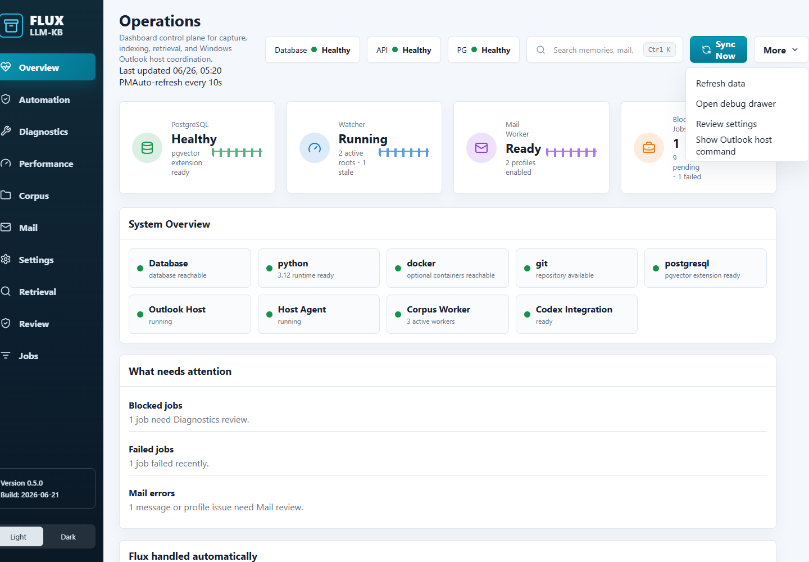
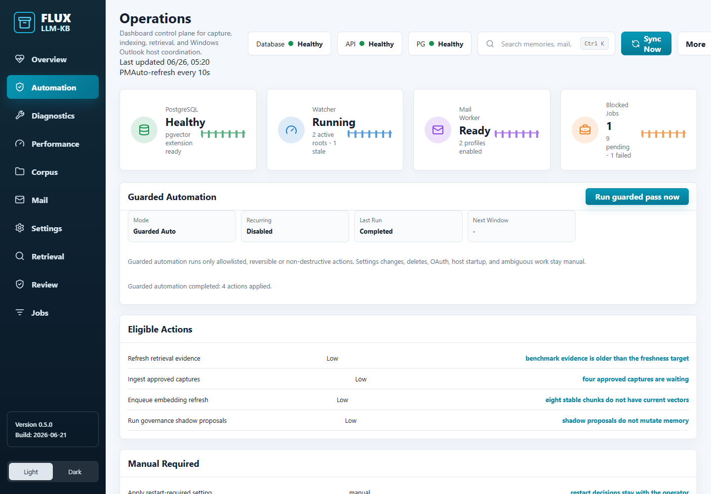
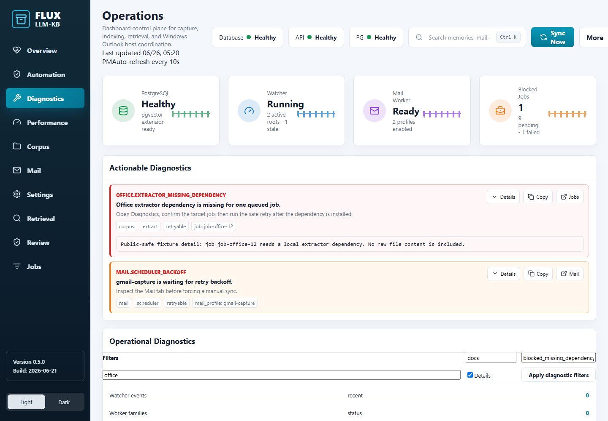
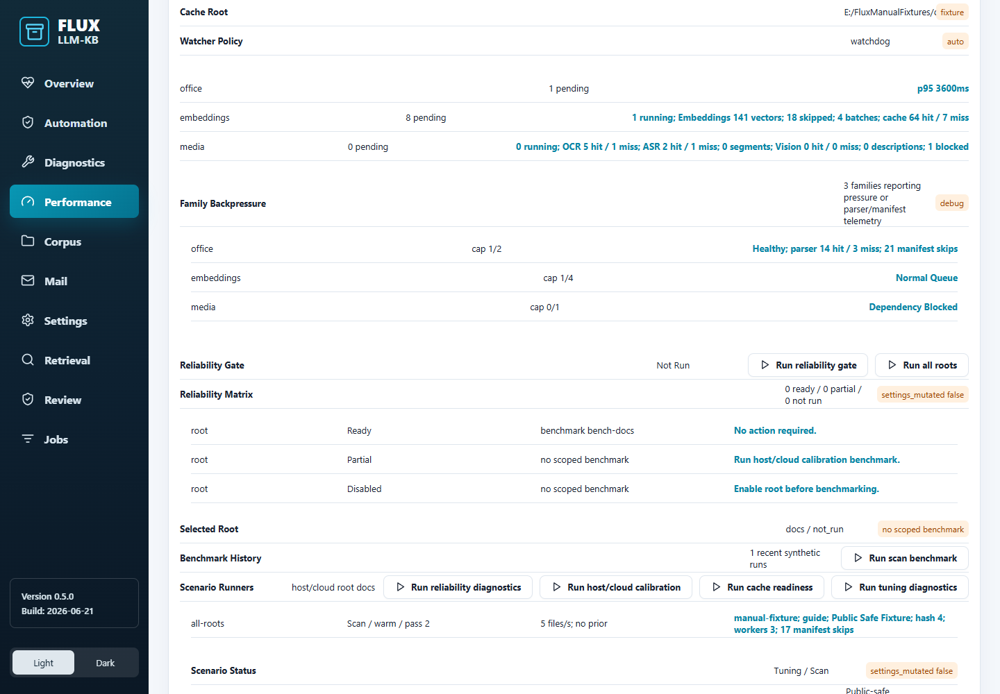
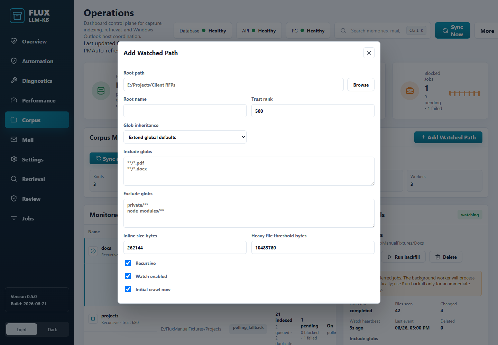
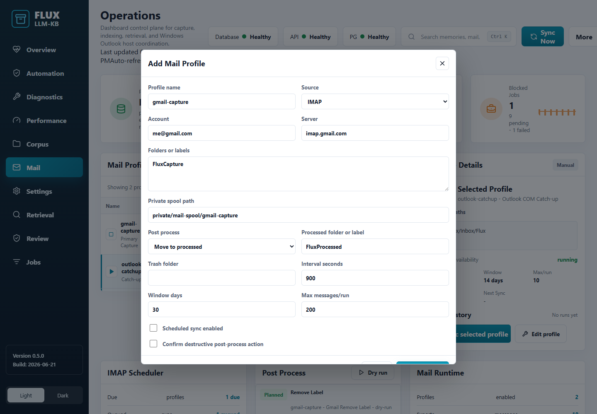
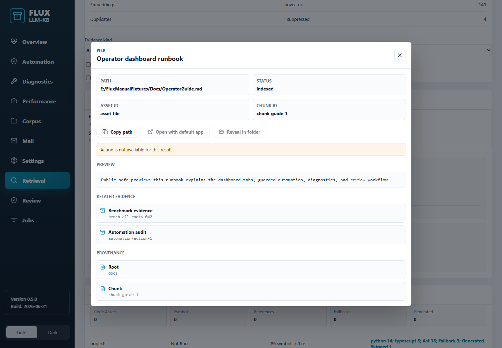
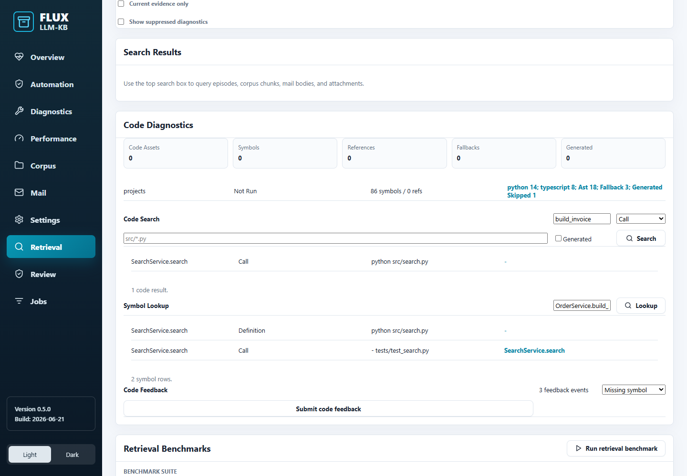
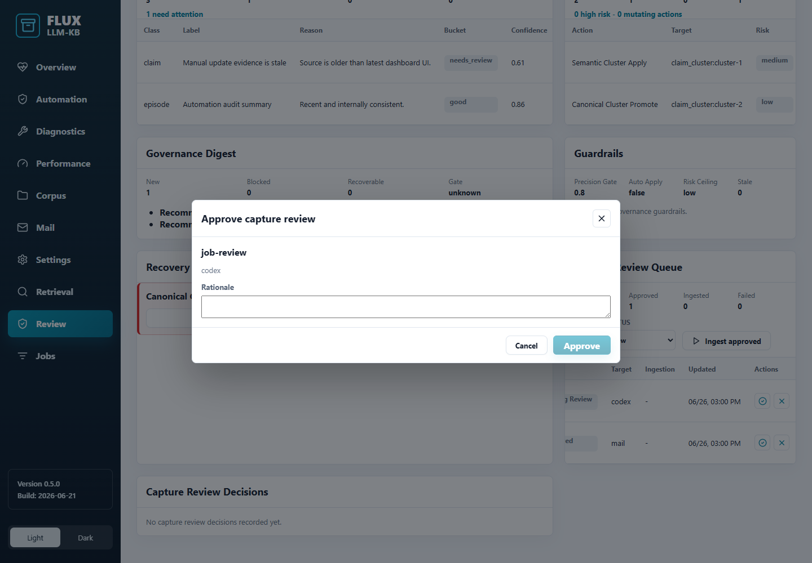
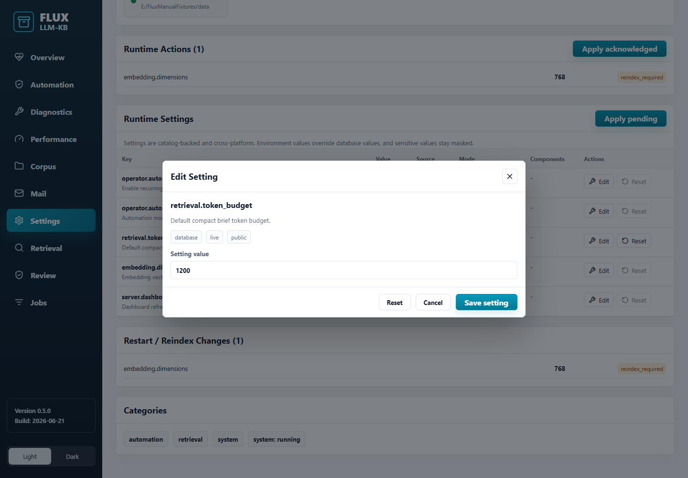

# Flux LLM KB Dashboard User Manual

This manual explains the Flux LLM KB dashboard in plain language. It is written for an operator who wants to understand what Flux is doing, what information appears on screen, which actions are available, what those actions change, and why some work remains manual.

The screenshots in this guide show the actual dashboard UI with public-safe mocked data. The names, counts, paths, profiles, jobs, and examples are invented fixtures. They are safe to commit and share because they do not include private local paths, mail bodies, credentials, raw memories, embeddings, or private wiki exports.

The dashboard is an operator console, not a marketing page. Its job is to help you decide what to trust, what to inspect, what to run, and what to leave alone. Most tabs are organized around a simple operating question: "Is the system healthy?", "What can Flux do safely?", "What needs a person?", "What evidence proves this?", or "What changed?"

> **Safety note:** Flux separates low-risk maintenance from decisions that can delete, expose, restart, reindex, authenticate, or mutate important local state. Guarded automation may do only allowlisted safe work. Anything risky, ambiguous, destructive, or credential-related stays manual.

## How To Read This Manual

The guide is organized the same way the dashboard is organized. Read the Global Dashboard Controls chapter first, then use the tab chapters as a reference.

Each tab chapter explains:

- **What you see:** the panels, tables, cards, badges, filters, controls, and messages on that screen.
- **Values can appear:** the status words, counts, badges, and fields you may see, with the practical meaning of each value. In plain terms, this means the manual names the values can appear on screen and explains what each value should make you do next.
- **What the actions do:** what buttons and forms trigger, what changes on screen, whether a job or setting is changed, and what stays manual.
- **Why it matters:** how the tab helps you avoid unsafe automation, stale evidence, silent failures, or unnecessary manual work.

The dashboard uses a few recurring patterns:

- **Cards** summarize a count or state. A card is usually read-only and points you to the next relevant panel.
- **Tables** show repeated records such as roots, jobs, settings, claims, captures, diagnostics, or benchmark runs.
- **Badges and pills** summarize status. Green or enabled means the item is available or healthy; warning or blocked means review is needed; disabled means Flux is intentionally not running that behavior.
- **Small icon buttons** perform row actions. Hover text or the manual explains the action when the icon is compact.
- **Disabled buttons** are intentional. A disabled button usually means the current item is not eligible, a required selection is missing, or the action is too risky for the current state.
- **Toasts** appear near the top after actions. They tell you whether the action was queued, completed, blocked, or failed.
- **Detail dialogs** show richer information without leaving the current workflow.

## Global Dashboard Controls


_Figure: The global dashboard chrome, top search box, Sync Now button, More menu, health strip, and navigation._

### What you see

The global layout is present on every tab.

- The left navigation lists **Overview**, **Automation**, **Diagnostics**, **Performance**, **Corpus**, **Mail**, **Settings**, **Retrieval**, **Review**, and **Jobs**.
- The header shows the dashboard title, the last refresh time, and the automatic refresh interval.
- The top status chips show quick health for database, API, and PostgreSQL.
- The search box labeled **Dashboard search** searches memory, mail, corpus chunks, and attachments through the local retrieval API.
- **Sync Now** runs a manual sync for the selected mail profile. If the selected profile is Outlook, it queues an Outlook host sync request. If it is IMAP or Gmail, it queues a mail sync run.
- **More** opens the action menu. It contains Refresh data, Open debug drawer, Review settings, and Show Outlook host command.
- The theme toggle lets you switch Light or Dark display mode.
- The health strip summarizes database, watcher, jobs, mail, retrieval, and blocked-job state.
- Toast notifications appear after actions such as sync, automation run, setting save, OAuth start, benchmark run, capture decision, or remediation.

### Values can appear

| Value | Meaning | What to do |
|---|---|---|
| Last updated | The most recent dashboard refresh time. | If it is stale, use Refresh data or wait for auto-refresh. |
| Auto-refresh every N seconds | How often the dashboard polls the API. | Change only from Settings if the interval is too aggressive or too slow. |
| Database green | PostgreSQL is reachable. | Continue normal work. |
| Database warning | The dashboard cannot verify persistence. | Use Diagnostics before trusting counts or audit rows. |
| API green | The dashboard frontend is receiving API responses. | Continue normal work. |
| PG green | PostgreSQL and pgvector readiness are available. | Retrieval and persistence should be usable. |
| Watcher active | One or more watched roots have filesystem watch or polling activity. | Use Corpus for root-specific state. |
| Jobs blocked | At least one background job is blocked. | Open Diagnostics or Jobs. |
| Mail backoff or blocked_auth_required | Mail sync needs retry time or authorization review. | Open Mail. |

### What the actions do

- **Dashboard search** sends a local explain/search request, then switches to Retrieval and shows Search Results. It does not mutate memory, files, mail, settings, or jobs.
- **Sync Now** queues a mail sync for the selected profile. It may create or update mail sync run records. It does not approve captures, mutate memories, or change mail post-process settings.
- **Refresh data** reloads the dashboard state from local APIs. It does not start jobs.
- **Open debug drawer** opens a local diagnostic drawer for developer-oriented state. It is read-only.
- **Review settings** switches to Settings.
- **Show Outlook host command** shows the command that can be run manually if the Outlook host process is not running. It does not start the host automatically.
- **Theme toggle** changes local browser display preference only.

### Why it matters

The global controls are meant to reduce context switching. You can search from anywhere, run the selected mail sync without opening Mail, jump to Settings from the menu, and confirm whether the dashboard itself is fresh before acting on any status.

Use the top search when your question is about evidence. Use the left navigation when your question is about operations. Use Sync Now only when you understand which mail profile is selected. Use More when you need refresh, debug, settings, or the Outlook host command.

## Overview Tab


_Figure: The read-only Overview tab showing system status, attention items, automatic work, and the next safe action._

### What you see

Overview is the starting point. It is read-only and friendly by design. It answers four questions:

- Is Flux healthy enough to trust right now?
- What needs attention?
- What did Flux already handle automatically?
- What is the next safe action?

The main panels are:

- **System Overview:** status tiles for database, runtime checks, Outlook host, host agent, corpus worker, and Codex integration.
- **What needs attention:** human-readable issues that deserve operator review.
- **Flux handled automatically:** safe work that Flux already completed or queued.
- **Next safe action:** the recommended next action based on current evidence.
- **Recent Errors:** raw recent error strings with a View button for more detail.

### Values can appear

| Screen value | Meaning | Typical response |
|---|---|---|
| Database reachable | Persistence is responding. | Continue normal review. |
| Runtime check green | Required runtime component is available. | No action. |
| Runtime check warning | Optional or required component reported a problem. | Open Diagnostics or Settings depending on the message. |
| Outlook Host running | The Outlook COM host process is alive. | Outlook sync can be requested. |
| Outlook Host stopped | The host process is not running. | Use Mail or the More menu to view the host command. Startup remains manual. |
| Host Agent running | The local host helper can browse folders or perform host-side support actions. | Folder browse buttons may work. |
| Corpus Worker active | At least one background worker is alive. | Jobs can progress. |
| Codex Integration ready | Hooks and MCP wiring are configured. | Codex capture and brief flows should work. |
| Codex restart required | Hook configuration changed and Codex needs restart. | Handle in Settings. |
| Needs attention | Overview found a state that deserves review. | Follow the recommended tab. |
| Flux handled automatically | A guarded or background action already happened. | Review Automation audit when needed. |

### What the actions do

Overview has no risky direct action. It can show View buttons for recent errors, but it does not run remediation, change settings, approve captures, delete roots, start host processes, reveal files, or apply governance.

Use its recommendations as navigation:

- Open **Automation** when Overview suggests a guarded pass.
- Open **Diagnostics** when errors or blocked items need investigation.
- Open **Performance** when reliability or benchmark evidence is stale.
- Open **Review** when capture or governance decisions need a person.
- Open **Settings** when restart, reindex, hook, or runtime changes need acknowledgement.

### Why it matters

Overview keeps routine operation calm. It prevents the old "Health tab overload" problem by showing the high-level story and sending you to a focused tab only when needed. If Overview is quiet, you do not need to inspect every detailed panel.

## Automation Tab


_Figure: Automation shows Guarded Auto posture, eligible safe actions, manual-required work, and audit history._


_Figure: After Run guarded pass now, the tab shows the completed run status and updated audit evidence._

### What you see

Automation shows what Flux can do safely and what it refuses to do automatically. It is the main place to reduce repetitive manual dashboard work without losing safety.

The main panels are:

- **Guarded Automation:** mode, recurring state, last run, next window, posture explanation, and the Run guarded pass now button.
- **Eligible Actions:** safe allowlisted work that can be performed by a guarded pass.
- **Manual Required:** items Flux has detected but will not perform automatically.
- **Automation Audit Trail:** recent action records with status, risk, source, evidence, and result summary.

### Values can appear

| Value | Meaning | What to do |
|---|---|---|
| Guarded Auto | The dashboard-supported automation posture. Only allowlisted low-risk actions may run. | Use this as the normal automation mode. |
| Recurring Disabled | Scheduled guarded passes are off. This is the default. | Run a manual guarded pass when needed. |
| Recurring Enabled | Scheduled guarded passes are allowed by settings. | Review audit history regularly. |
| Last Run Completed | The previous pass finished. | Inspect audit rows if you need details. |
| Last Run Failed | The previous pass encountered an error. | Open Diagnostics and review audit evidence. |
| Next Window Manual | No scheduled run is due. | Use Run guarded pass now for a one-shot pass. |
| Eligible | The action is safe enough for guarded automation. | It may run during a guarded pass. |
| Manual required | Flux found work but intentionally left it to a person. | Open the owning tab and decide manually. |
| Applied | The guarded action completed. | Review result if the count changed. |
| Skipped | Flux decided no action was needed or cooldown prevented it. | Usually no action. |
| Blocked | Preconditions were missing. | Use Diagnostics or the owning tab. |
| settings_mutated false | The guarded pass did not change runtime settings. | This is expected and required. |

### What the actions do

**Run guarded pass now** sends a bounded run request with mode `guarded`, dry-run false, and a default limit. The pass may:

- Refresh retrieval or reliability evidence.
- Ingest captures that were already approved.
- Enqueue or backfill missing embeddings when the operation is safe.
- Run governance in shadow mode to prepare proposals.
- Run safe diagnostic recovery if a remediation is allowlisted.
- Record durable run and action history with sanitized evidence.

The pass must not:

- Delete roots or purge index rows.
- Start OAuth.
- Start host processes.
- Change settings.
- Apply restart or reindex changes.
- Approve or reject capture jobs.
- Apply high-risk governance.
- Open or reveal local files.
- Guess on ambiguous work.

When the action completes, the tab shows a toast and a run status line such as "Guarded automation completed: 4 actions applied." The audit trail then explains what happened.

### Why it matters

Automation is how Flux removes repetitive safe work while keeping the operator in control. The tab is deliberately transparent: you see what is eligible, what is blocked, what stayed manual, and whether settings changed. The correct operating posture is not "automate everything." It is "automate low-risk maintenance with an audit trail and keep risky decisions manual."

### Operator tips

- Run a guarded pass after Overview says evidence is stale or safe work is waiting.
- Read Manual Required before doing manual work. It often tells you exactly why Flux refused an action.
- Treat a missing or confusing audit row as a bug or documentation gap.
- Do not enable recurring automation until manual guarded passes have produced useful, boring audit history on your workload.

## Diagnostics Tab


_Figure: Diagnostics groups actionable diagnostics, operational filters, recent errors, copy actions, and remediation buttons._


_Figure: A structured diagnostic expanded to show public-safe technical detail and navigation/copy actions._

### What you see

Diagnostics is where operational problems live. It is for error details, repair, filtering, and navigation. It is not the place for general health summary or performance benchmarking.

The main panels are:

- **Actionable Diagnostics:** structured diagnostics from dashboard health. Each diagnostic has a code, message, user action, component, stage, retryability, target, and optional navigation link.
- **Operational Diagnostics:** filterable diagnostics loaded from the diagnostics API. Filters include root, status, family, and detail inclusion.
- **Recent Errors:** recent plain error strings with a View button.

### Values can appear

| Value | Meaning | Practical effect |
|---|---|---|
| Severity error | The diagnostic likely blocks work. | Inspect and remediate if safe. |
| Severity warning | Work may continue, but review is recommended. | Check the owning tab. |
| Severity info | Informational or advisory. | Use only if relevant. |
| retryable | The action can be tried again safely when prerequisites are met. | A retry button may be available. |
| not retryable | Repeating the same action is unlikely to help. | Read detail and use the owning tab. |
| blocked_missing_dependency | A local dependency is missing. | Install or configure dependency manually, then retry. |
| failed | A job or diagnostic action failed. | Expand detail and inspect target. |
| completed | A remediation or job finished. | Usually no further action. |
| root_name filter | Limits diagnostics to one watched root. | Use when one root is noisy. |
| family filter | Limits diagnostics to worker family such as office, media, embeddings, mail, or crawler. | Use when a specific pipeline is blocked. |
| include_details true | Requests richer structured details. | Useful for support or debugging. |

### What the actions do

- **Details** expands a structured diagnostic inline. It shows technical detail in a safe form. It does not reveal private raw content.
- **Copy** copies diagnostic content for notes or support. It should copy bounded diagnostic metadata, not raw private payloads.
- **Open Jobs, Mail, Retrieval, Corpus, Settings, or Review** navigates to the tab that owns the problem.
- **Apply diagnostic filters** reloads operational diagnostics using the filter inputs.
- **Remediation buttons** can retry safe jobs, repair safe asset statuses, clear completed errors, or enqueue bounded recovery work depending on what the backend exposes.

Diagnostics remediation does not mutate settings. If the fix requires restart, reindex, OAuth, host startup, destructive deletion, or a broad policy change, Diagnostics should point you to the manual tab instead.

### Why it matters

Diagnostics prevents blind retries. It tells you what failed, why it failed, which target is affected, whether retry is safe, and where to continue. This keeps the dashboard robust: recovery actions are available when appropriate, but the UI does not hide risk behind a generic "fix everything" button.

### Common diagnostic examples

| Diagnostic | What it means | Best next action |
|---|---|---|
| office.extractor_missing_dependency | An Office extraction job needs a missing local parser or dependency. | Install/configure the dependency, then retry from Diagnostics or Jobs. |
| mail.scheduler_backoff | Mail sync is waiting after a failure. | Open Mail and check profile/OAuth/network state. |
| embedding.refresh_backlog | Chunks are ready but vectors are missing or stale. | Run guarded automation or a bounded backfill. |
| watcher.stale | A watched root has not produced a fresh heartbeat. | Open Corpus and inspect the root watcher. |
| governance.shadow_blocked | Governance proposal run could not complete. | Open Review and inspect guardrails/digest. |

## Performance Tab


_Figure: Performance shows operator evidence, acceleration capability, cache readiness, reliability gates, and worker telemetry._


_Figure: Running a benchmark or diagnostics scenario adds metadata-only evidence and manual recommendation candidates._

### What you see

Performance answers: "Can Flux do this work well, and what evidence proves it?" It owns acceleration capability, cache readiness, reliability gates, benchmark history, and worker-family telemetry.

The main panels are:

- **Operator Evidence:** read-only evidence gates and manual follow-up recommendations.
- **Acceleration:** CPU, memory, cache, worker-family, benchmark, reliability, and optional model/provider readiness.

Performance is not for direct setting mutation. It can produce evidence and manual candidates, but it should not silently change settings.

### Values can appear

| Value | Meaning | What to do |
|---|---|---|
| ready | Capability, cache, or evidence is available. | Continue normal work. |
| partial | Some evidence is available, but not enough for a strong decision. | Run a benchmark or inspect diagnostics. |
| blocked | Required dependency or state is missing. | Open Diagnostics or install the dependency manually. |
| disabled | The feature is intentionally off. | Enable only if you need it and understand the setting. |
| not_required | The check is not required for the current configuration. | No action. |
| pass | Reliability or benchmark gate passed. | Use as evidence. |
| warning | Gate passed with caveats or freshness issues. | Review detail before tuning. |
| failed | Gate failed. | Open Diagnostics or Jobs. |
| cache hit | Flux reused cached work. | Good for performance. |
| cache miss | Flux had to compute or extract again. | Normal for new content; investigate if unexpectedly high. |
| backpressure | A worker family is queueing work faster than it can process. | Check Jobs and worker caps. |
| manual recommendation candidate | Evidence suggests a possible setting change, but Flux will not apply it automatically. | Review and change in Settings only if appropriate. |

### What the actions do

- **Run reliability diagnostics** runs a bounded reliability evidence pass.
- **Run all-root reliability diagnostics** checks readiness across all configured roots.
- **Run scan benchmark** runs a scan-mode benchmark against synthetic or selected fixture scope.
- **Run reliability diagnostics, host/cloud diagnostics, cache readiness diagnostics, tuning diagnostics** run scenario-specific benchmark evidence.
- These actions may create benchmark history rows and diagnostics.
- These actions may propose manual follow-up commands or setting candidates.
- These actions must report `settings_mutated: false`.

### Why it matters

Performance is the evidence layer. Without it, tuning becomes guesswork. A high queue count may be normal after adding a root. A slow job may be harmless if it is a large file. A manual candidate may look tempting but should not be applied unless benchmark history shows it improves your workload.

Use Performance before changing throughput-related settings. Use Jobs when you need to see individual work items. Use Diagnostics when a worker is blocked or failing.

## Corpus Tab


_Figure: Corpus shows monitored roots, root details, watcher state, extractor availability, crawl jobs, and root-level controls._


_Figure: The Add Watched Path form captures root name, path, glob policy, trust rank, crawl, watch, and size thresholds._

### What you see

Corpus is where you manage watched local folders and the files Flux indexes. It is the operational view for roots, crawl policy, watcher state, recent assets, recent jobs, and extractor availability.

The main panels are:

- **Corpus Monitor:** top-level root counts and bulk actions.
- **Monitored Roots:** table of configured roots.
- **Root Details:** selected root metadata, globs, watcher heartbeat, latest crawl, recent assets, and recent jobs.
- **Extractor Availability:** optional parser/tool readiness.

### Values can appear

| Value | Meaning | What to do |
|---|---|---|
| watching | The root has active watch or polling behavior. | Normal state. |
| polling_fallback | Native watching is not active, but polling can still detect changes. | Accept if expected; check Performance if watcher evidence matters. |
| disabled | The root is configured but not currently indexing. | Enable only when you want Flux to process it. |
| stale | The watcher heartbeat or crawl evidence is old. | Run sync or inspect Diagnostics. |
| indexed | Asset has been extracted and indexed. | Search should be able to use it. |
| queued | Asset or job is waiting for a worker. | Check Jobs if queue stays high. |
| blocked_missing_dependency | A job needs a dependency. | Install/configure manually, then retry. |
| duplicate_suppressed | Flux detected duplicate content and suppressed duplicate evidence. | Usually no action. |
| include_globs | File patterns allowed for this root. | Use to limit what Flux sees. |
| exclude_globs | File patterns excluded from this root. | Use to avoid private, generated, or noisy paths. |
| glob_mode inherit | Use global policy. | Good default. |
| glob_mode extend | Add root-specific globs to global policy. | Use for normal root customization. |
| glob_mode override | Replace global policy for this root. | Use carefully. |

### What the actions do

- **Add Watched Path** opens the root form. Saving creates a root configuration and can optionally start an initial crawl.
- **Sync all** runs a crawl sync for configured roots. It may enqueue extraction or embedding jobs.
- **Refresh** reloads corpus state.
- **Enable all watch / Disable all watch** toggles watch mode without deleting roots.
- **Select root** changes the root shown in Root Details.
- **Sync root** runs a crawl sync for one root.
- **Dry run root** previews crawl changes without indexing.
- **Run backfill** processes deferred work such as extraction or embedding refresh for the selected root.
- **Enable or disable watch** toggles watch behavior for one root.
- **Edit** opens the root form with current values.
- **Delete** opens a confirmation. The dashboard delete action may purge index rows when confirmed, but it does not delete files from disk.

### Why it matters

Corpus controls the boundary between your local files and Flux memory. The main safety principle is simple: adding and syncing are powerful, but deleting, purging, broad rescans, and overly broad globs deserve careful manual attention.

Use include/exclude globs to avoid indexing private exports, generated folders, caches, build outputs, or credentials. Use dry run when you are unsure what a sync will touch. Use backfill when jobs are known-safe and queued. Use Diagnostics when a job is blocked.

### Add or edit watched path fields

| Field | What it means | Safe default |
|---|---|---|
| Root name | Friendly identifier shown in tables, filters, jobs, and diagnostics. | Short lowercase name such as docs or projects. |
| Root path | Local folder to monitor. | Use a scoped folder, not an entire drive. |
| Recursive | Include subfolders. | On for normal project or document roots. |
| Watch enabled | Let Flux notice changes after initial crawl. | On when the root is active. |
| Initial crawl | Start a crawl after saving. | On for a new root you trust. |
| Trust rank | Relative evidence trust score. | Keep default unless you have a policy reason. |
| Include globs | Allowed file patterns. | Prefer explicit patterns for code or sensitive roots. |
| Exclude globs | Blocked patterns. | Always exclude private, cache, build, and temp folders when relevant. |
| Max inline bytes | Maximum small-file inline read threshold. | Keep default unless advised by Performance evidence. |
| Heavy threshold bytes | Size threshold for heavier extraction paths. | Keep default unless advised by benchmark evidence. |

## Mail Tab


_Figure: Mail shows profile list, profile details, scheduler state, OAuth state, runtime state, post-process policy, and mail errors._


_Figure: The Add Mail Profile form captures source type, account, folders, private spool path, sync cadence, and post-process policy._

### What you see

Mail is where you configure and operate mail capture sources. It covers IMAP/Gmail profiles, Outlook COM profiles, OAuth status, scheduler state, runtime state, post-process dry-runs, and recent mail errors.

The main panels are:

- **Mail Profiles:** list of configured profiles and row actions.
- **Profile Details:** selected profile state, folders, schedule, OAuth actions, sync actions, and edit button.
- **IMAP Scheduler:** due, queued, running, backoff, failed, and auth-blocked run counts.
- **Mail Runtime:** Outlook host or mail worker status.
- **Post Process:** configured post-process policy, dry-run button, and recent events.
- **Mail Errors:** recent mail diagnostics and View buttons.

### Values can appear

| Value | Meaning | What to do |
|---|---|---|
| Enabled | Scheduled sync is enabled for the profile. | Normal for active capture. |
| Manual | Scheduled sync is off; use manual sync when needed. | Normal for occasional sources. |
| IMAP | Profile connects through IMAP or Gmail IMAP. | Check server, account, folders, OAuth if blocked. |
| Outlook COM | Profile uses the local Outlook host. | Host startup remains manual. |
| due | Scheduler says a profile is due for sync. | It should queue automatically if enabled. |
| queued | A sync run is waiting. | Check Jobs or scheduler if it does not move. |
| running | A sync run is active. | Wait or inspect if stuck. |
| completed | A sync finished. | Review counts and captures. |
| backoff | A run failed and is waiting before retry. | Read error before forcing sync. |
| blocked_auth_required | OAuth or credentials are missing/expired. | Start OAuth manually. |
| remove_label | Gmail post-process can remove a label after capture. | Dry-run before enabling. |
| move_to_processed | Move captured mail to a processed folder. | Confirm folder policy. |
| none | Leave mail in place. | Safest default. |
| trash/delete | Destructive post-process action. | Requires explicit confirmation and remains manual-risk. |

### What the actions do

- **Add Profile** opens the profile form.
- **Sync profile** queues a manual sync for the selected profile.
- **Edit profile** opens the profile form with current values.
- **More profile** selects the profile for detail inspection.
- **Save OAuth client JSON path** stores the private OAuth client configuration path for the profile.
- **Start Gmail OAuth** opens an authorization flow. It may open a browser popup and changes credential state. It always remains manual.
- **Dry run post process** previews mail post-process actions without changing mailbox state.
- **Sync Now** in the global header also queues sync for the selected mail profile.

### Why it matters

Mail capture can create valuable memory, but it touches sensitive data and external accounts. Flux therefore separates sync, review, and post-processing:

- Sync can export messages into a private spool.
- Capture review decides what may become memory.
- Post-process policy decides what happens to mailbox messages after capture.
- OAuth and destructive policies require a person.

Use dry-run before changing post-process policy. Do not use destructive post-process actions unless you have tested the profile and understand the mailbox effect.

## Retrieval Tab


_Figure: Retrieval owns search quality, explain traces, benchmark history, consumer access examples, and code diagnostics._


_Figure: Selecting a result opens a detail dialog with preview, safe metadata, explanation, related evidence, provenance, and manual file actions._


_Figure: Code Diagnostics lives in Retrieval because code parser coverage, symbol lookup, relationship search, and sanitized feedback affect retrieval quality._

### What you see

Retrieval is where you check answer quality and search behavior. It owns search, result explanation, retrieval benchmarks, code diagnostics, and consumer access examples.

The main panels are:

- **Retrieval Console:** evidence counts and search filters.
- **Search Results:** result cards, snippets, source paths, related evidence counts, and "Why this result" explanation.
- **Code Diagnostics:** parser coverage, code-search filters, symbol lookup, generated-file handling, hotspots, and feedback.
- **Retrieval Benchmarks:** benchmark suite selection, run button, history, confidence bands, calibration thresholds, and advisory candidates.
- **Consumer Access:** REST, MCP, and CLI examples for search, explain, and brief usage.
- **Recent Errors:** retrieval-related recent errors.

### Values can appear

| Value | Meaning | What to do |
|---|---|---|
| Episodes | Conversational or captured memory records. | High counts mean more remembered context. |
| Sources | Distinct source records. | Useful for provenance breadth. |
| Corpus chunks | Indexed file chunks. | Search can return these. |
| Embeddings | Vector rows available for semantic retrieval. | Low count may indicate embedding backlog. |
| Duplicates suppressed | Duplicate evidence hidden from results. | Usually good; inspect if expected evidence is missing. |
| Evidence kind All | Search episodes, files, mail, and attachments. | Good default. |
| Evidence kind Files | Limit search to corpus/file evidence. | Use for file troubleshooting. |
| Evidence kind Mail | Limit search to mail evidence. | Use for capture/mail questions. |
| Current evidence only | Hide stale/superseded evidence. | Use for operational decisions. |
| Show suppressed diagnostics | Include suppression reasoning. | Use when expected evidence is missing. |
| Why this result | Opens ranking and suppression details. | Use to understand confidence. |
| top1 accuracy | Benchmark top result quality. | Compare before/after tuning. |
| brief dilution | Benchmark measure of irrelevant brief content. | Lower is better. |
| settings_mutated false | Benchmark did not change runtime settings. | Required for evidence-only runs. |
| generated files | Code files classified as generated. | Usually excluded from quality signals. |
| fallback parser | Parser could not use a richer language parser. | Investigate if code search quality is weak. |

### What the actions do

- **Top search box** runs explain/search and switches to Retrieval.
- **Clear results** clears the current search result display.
- **Evidence kind filter** changes which evidence types future searches use.
- **Current evidence only** limits future search to current evidence.
- **Show suppressed diagnostics** asks retrieval to include suppression context.
- **Select result** opens the result detail dialog.
- **Why this result** expands ranking, scope, score, source, duplicate suppression, and lifecycle information.
- **Run code search** searches code symbols/relationships with query, relationship, path glob, and include-generated options.
- **Lookup code symbol** finds symbol definitions and references.
- **Submit code feedback** records sanitized feedback that code search missed something. It should not store raw private code.
- **Run retrieval benchmark** runs the selected benchmark suite and records metadata-only evidence.

### Why it matters

Retrieval is where trust is proven. If search results are surprising, the answer is usually in filters, lifecycle state, suppression, duplicate handling, missing embeddings, parser coverage, or stale benchmark evidence. This tab gives you the tools to inspect those causes instead of assuming the answer quality is good or bad.

Use Retrieval when you are checking whether Flux can find the right evidence. Use Review when you are deciding whether remembered evidence is true or should change. Use Performance when you are measuring throughput or reliability rather than result quality.

## Review Tab


_Figure: Review keeps human judgment in one place: claims, entity graph, retention tuning, memory quality, governance, recovery, capture review, and decisions._


_Figure: Capture review approval or rejection requires a rationale before the decision is recorded._

### What you see

Review is where Flux asks for human judgment. It is intentionally different from Automation. Automation can run shadow proposals or ingest already-approved captures; Review is where a person approves, rejects, applies, recovers, or tunes judgment-heavy memory behavior.

The main panels are:

- **Claim Review:** claims needing review, filters, counts, lifecycle state, confidence, retention action, and transitions.
- **Selected Claim:** detail for the selected claim.
- **Entity Graph:** related entities and relationships for the selected claim.
- **Retention Tuning:** policy rows by memory class.
- **Memory Quality:** candidates for review, retention, or suppression.
- **Governance Automation:** button to run governance in shadow mode.
- **Governance Digest:** summary and recommendations from recent governance runs.
- **Guardrails:** policy boundaries such as protected classes and manual apply requirements.
- **Recovery:** recoverable governance actions.
- **Capture Review Queue:** pending, approved, rejected, completed, failed, or blocked capture jobs.
- **Capture Review Decisions:** audit rows for recent decisions.

### Values can appear

| Value | Meaning | What to do |
|---|---|---|
| needs_review | A claim or capture needs human judgment. | Inspect and decide. |
| current | Evidence is considered current. | Usually no action. |
| stale | Evidence may be outdated. | Confirm, retire, or seek newer evidence. |
| contradicted | Another memory conflicts with this one. | Review carefully. |
| superseded | Newer evidence replaced this one. | Usually safe to retire or keep as history depending on policy. |
| retention_action review | Policy says the item should be reviewed. | Inspect before automated retention is expanded. |
| governance shadow | Governance can propose but not mutate. | Review proposals manually. |
| proposed | A governance action is ready for review. | Apply only if safe. |
| applied | A governance action was applied. | Recovery may be available. |
| recovered | An action was rolled back. | Review audit trail. |
| pending_review | A capture job needs approve/reject. | Decide with rationale. |
| approved | Capture passed review. | Guarded automation may ingest it. |
| rejected | Capture should not be ingested. | No ingestion. |
| blocked_missing_dependency | Capture cannot proceed because dependency/source is missing. | Fix manually or leave blocked. |

### What the actions do

- **Refresh** reloads review state.
- **Select claim** changes the selected claim and graph.
- **Confirm, retire, or other claim transition buttons** call claim lifecycle transition APIs.
- **Save retention policy** updates policy for one memory class. This is manual and audited.
- **Run shadow** runs governance in shadow/proposal mode. It should not mutate settings and should not apply high-risk changes.
- **Apply governance action** mutates memory according to the proposal. It remains manual.
- **Recover governance action** applies the recorded recovery path when available.
- **Approve capture job** opens a decision dialog. A rationale is required before approval.
- **Reject capture job** opens a decision dialog. A rationale is required before rejection.
- **Ingest approved** ingests approved captures. Guarded automation can also ingest already-approved captures.

### Why it matters

Review is the safety valve for memory quality. It protects against blindly accepting stale claims, importing unwanted captures, applying duplicate merges too aggressively, or letting automation mutate high-impact memories. The required rationale fields are not paperwork; they create an audit trail that explains why the memory changed.

Use Review for decisions. Use Automation for safe maintenance. Use Retrieval to inspect evidence. Use Diagnostics when review cannot proceed because a dependency or job is blocked.

## Settings Tab


_Figure: Settings owns Codex hooks, deployment, runtime actions, runtime settings, restart/reindex changes, and categories._


_Figure: Editing a setting shows the key, description, source, apply mode, sensitivity, value field, reset button, and save action._

### What you see

Settings is where operational configuration lives. It intentionally owns system-level panels that used to crowd the old Health tab.

The main panels are:

- **Codex Hooks:** hook policy, preflight brief, turn capture, MCP tools, and recent hook events.
- **Deployment:** install root, app root, private/data/log directories, image tag, mode, and repo-coupling state.
- **Runtime Actions:** acknowledged and pending restart/reindex/runtime action requests.
- **Runtime Settings:** effective setting rows, values, source, apply mode, sensitivity, edit/reset actions.
- **Restart / Reindex Changes:** settings that need restart or reindex handling.
- **Categories:** setting categories and groupings.

### Values can appear

| Value | Meaning | What to do |
|---|---|---|
| source default | Value is from the catalog default. | Usually no action. |
| source database | Value was changed and persisted. | Review whether it is still intended. |
| source env | Value is controlled by environment/config outside the dashboard. | Change outside dashboard if needed. |
| apply_mode live | Saving applies immediately without restart or reindex. | Safe for normal edits if you understand the setting. |
| apply_mode restart_required | Saving queues or requires a runtime restart action. | Confirm manually. |
| apply_mode reindex_required | Saving may require reindexing evidence. | Confirm manually and plan timing. |
| read_only | The dashboard cannot edit this setting. | Change source configuration if necessary. |
| sensitive | Value may contain sensitive information. | Avoid copying into tickets or screenshots. |
| operator.automation.enabled false | Recurring guarded automation is disabled. | Default and safest posture. |
| operator.automation.mode guarded | Guarded mode is selected. | Expected dashboard automation mode. |

### What the actions do

- **Edit setting** opens the setting editor dialog.
- **Save setting** sends the new value. If the apply mode requires confirmation, the dashboard opens a confirmation dialog or queues a runtime action.
- **Reset** resets a non-default setting to catalog default when allowed.
- **Apply pending / Apply acknowledged** applies pending runtime action acknowledgements.
- **Review restart/reindex changes** lets you inspect settings that need more than a live save.

Settings actions can affect runtime behavior. Unlike guarded automation, Settings is allowed to mutate settings when you explicitly save or confirm. That is why restart and reindex changes stay here instead of Automation.

### Why it matters

Settings is the place for explicit operator intent. If a change can alter runtime behavior, polling frequency, automation cadence, retrieval budgets, embedding dimensions, hooks, restart behavior, or reindex needs, it belongs in Settings. This keeps Overview friendly and Automation guarded.

## Jobs Tab


_Figure: Jobs shows queued, running, completed, failed, and blocked background work plus worker-family status._

### What you see

Jobs shows background work by status, family, age, target, attempts, and error. It is visibility-first. Diagnostics owns safe repair actions; Jobs shows the work queue and worker-family state.

The main panels are:

- **Job Queue:** individual jobs with type, family, status, target, attempts, timestamps, error, and expandable detail.
- **Worker Family Status:** summary rows for worker families such as office, media, embeddings, crawler, governance, or mail.

### Values can appear

| Value | Meaning | What to do |
|---|---|---|
| queued | Waiting for a worker. | Normal if queue drains. |
| running | Worker is processing it now. | Wait unless stuck. |
| completed | Job finished. | No action. |
| failed | Job failed. | Open detail and Diagnostics. |
| blocked_missing_dependency | Dependency is missing. | Install/configure manually, then retry. |
| retrying_locked | Retry is scheduled or lock-protected. | Avoid manual duplicate retry unless advised. |
| blocked_locked | Blocked state is protected to avoid churn. | Use Diagnostics. |
| family office | Office/document extraction. | Check extractor availability. |
| family media | OCR/ASR/video/image extraction. | Check optional dependencies and Performance. |
| family embeddings | Vector refresh. | Guarded automation may enqueue safe refresh. |
| family mail | Mail sync/capture work. | Open Mail for profile state. |
| attempts | How many times the job tried. | High attempts suggest dependency/config issue. |

### What the actions do

- **Refresh** reloads job state.
- **Show details / Hide details** expands job payload, target, and diagnostic metadata.
- Row links or target text help you identify the owning root, profile, or evidence item.

Jobs does not delete files, purge roots, approve captures, start OAuth, or change settings. If you need to fix something, use Diagnostics or the owning tab.

### Why it matters

Jobs tells you whether background work is healthy, stalled, or blocked. It prevents false assumptions. A search miss may be caused by queued embeddings. A stale root may be caused by blocked extraction. A performance issue may be a worker-family bottleneck rather than a retrieval bug.

## Result Details


_Figure: Result details show preview, safe metadata, copy/open/reveal controls, disabled reasons, related evidence, and provenance._

### What you see

Result details open when you select a search result. The dialog can show file evidence or mail evidence.

For file results, you may see:

- Path or canonical path.
- Status.
- Asset id.
- Chunk id.
- Copy path button.
- Open with default app button.
- Reveal in folder button.
- Disabled action reasons.
- Preview text.
- Related evidence.
- Provenance rows.

For mail results, you may see:

- From, To, Received, Profile, Folder, and Export state.
- Sanitized HTML or text body when available.
- Attachments.
- Related evidence.
- Provenance.

### Values can appear

| Value | Meaning | What to do |
|---|---|---|
| Preview available | Extracted text can be shown. | Use it to confirm relevance. |
| No extracted text | The file or mail body has no readable preview. | Check extraction jobs or source type. |
| Copy path enabled | Dashboard can copy safe local metadata. | Use when you need to find evidence manually. |
| Open disabled | Opening local file is not available or not safe in current state. | Use manual file handling if necessary. |
| Reveal disabled | Revealing local folder is not available or not safe in current state. | Use manual file handling if necessary. |
| Related evidence | Other evidence linked to this result. | Use to understand context. |
| Provenance | Where the result came from. | Use to evaluate trust. |

### What the actions do

- **Copy path** copies the canonical path when allowed.
- **Open with default app** asks the host to open the file when allowed. It stays manual because it can launch local applications.
- **Reveal in folder** asks the host to show the file location when allowed. It stays manual because it can expose private local paths.
- **Close** closes the dialog without changing data.

### Why it matters

Result details are the bridge between answer quality and source inspection. They let you verify why a result was retrieved, whether its preview supports the answer, and what provenance it carries. The manual file actions are explicit because opening or revealing local files crosses from dashboard metadata into the user machine.

## Common Workflows

These workflows describe the what, how, and why for common operator tasks.

### Daily dashboard check

1. Start on Overview.
2. Confirm System Overview does not show unexpected warnings.
3. Read What needs attention.
4. If Flux handled work automatically, open Automation and scan the latest audit rows.
5. If an error is listed, open Diagnostics and expand the structured detail.
6. If benchmark or reliability evidence is stale, open Performance and run the relevant evidence pass.
7. If captures or governance proposals are waiting, open Review.
8. End in Jobs only if background work is blocked, old, or not draining.

Why: this path starts broad, then narrows only where evidence says attention is needed.

### Run a guarded automation pass

1. Open Overview and confirm the next safe action recommends automation or evidence refresh.
2. Open Automation.
3. Read Eligible Actions and Manual Required.
4. Click Run guarded pass now.
5. Wait for the completion toast and status line.
6. Review Automation Audit Trail.
7. If manual-required items remain, open the owning tab and decide manually.

Why: a guarded pass is useful only when you understand both what it can do and what it refused to do.

### Diagnose a blocked extraction

1. Open Diagnostics.
2. Filter by root name if one root is affected.
3. Filter by family such as office or media.
4. Expand the diagnostic detail.
5. Use Copy if you need to save the safe diagnostic text.
6. Use the navigation button to open Jobs or Corpus.
7. Install or configure missing dependencies manually if needed.
8. Return to Diagnostics and run the safe retry only after the cause is addressed.

Why: repeated retries without fixing a dependency waste time and clutter audit history.

### Add a watched folder

1. Open Corpus.
2. Click Add Watched Path.
3. Choose a narrow root path instead of a whole drive.
4. Give the root a short clear name.
5. Keep Recursive on only if subfolders are intended.
6. Add include and exclude globs for noisy or private folders.
7. Keep watch enabled for active folders.
8. Use initial crawl only when you trust the scope.
9. Save the watched path.
10. Review Jobs and Diagnostics for any blocked extraction.

Why: root scope controls what Flux can see. A narrow root with clear globs is safer and easier to debug.

### Configure mail capture safely

1. Open Mail.
2. Click Add Profile or Edit on an existing profile.
3. Choose IMAP, Gmail IMAP, or Outlook COM.
4. Enter account, folders, and private spool path.
5. Keep scheduled sync disabled until the profile is tested.
6. Use post_process_policy none until you have run dry-runs.
7. Save the profile.
8. For Gmail, save OAuth client JSON path and start OAuth manually.
9. Run Sync Now or a profile sync.
10. Review capture jobs in Review before ingestion.

Why: mail can contain sensitive content and mailbox state. Sync, review, OAuth, and post-process policy need separate decisions.

### Search and inspect a result

1. Use the top Dashboard search box.
2. If needed, switch to Retrieval and adjust Evidence kind.
3. Enable Current evidence only for operational decisions.
4. Enable Show suppressed diagnostics if expected evidence is missing.
5. Select a result.
6. Read preview, score, source, related evidence, and provenance.
7. Expand Why this result when ranking or suppression is unclear.
8. Use Copy path only if you need manual source inspection.

Why: answer trust comes from matching the result to provenance and explanation, not just seeing a high score.

### Review captures and governance

1. Open Review.
2. Start with Capture Review Queue.
3. Approve or reject each capture with a rationale.
4. Ingest approved captures only after review.
5. Review Governance Digest.
6. Run shadow proposals if evidence is stale.
7. Apply a governance action only when risk, rationale, evidence, and recovery are acceptable.
8. Use Recovery if an applied action needs rollback.

Why: review is where human judgment enters the memory system. Rationale and recovery make changes auditable.

### Change a runtime setting safely

1. Open Settings.
2. Find the setting row.
3. Read source, apply mode, sensitivity, and description.
4. Click Edit.
5. Change the value.
6. If apply mode is live, save after confirming the value.
7. If restart_required or reindex_required, read the confirmation carefully.
8. Apply pending or acknowledged runtime actions only when you are ready for the operational effect.
9. Return to Overview and Diagnostics after the change.

Why: settings are explicit operator intent. They are not part of guarded automation because they can change runtime behavior.

## Status And Value Glossary

This glossary explains common values that can appear across multiple tabs.

| Value | Where it appears | Meaning |
|---|---|---|
| ok | Health, diagnostics, capabilities | The check passed. |
| ready | Performance, settings, evidence | The capability or evidence is available. |
| disabled | Automation, mail, corpus, performance | The feature is intentionally off. |
| warning | Diagnostics, health, performance | Review is recommended but the system may continue. |
| error | Diagnostics, recent errors | Something failed or is blocking work. |
| blocked | Jobs, diagnostics, automation | Work cannot proceed until a condition changes. |
| blocked_missing_dependency | Jobs, diagnostics, capture review | A required local dependency is missing. |
| pending | Jobs, settings, runtime actions | Waiting for worker or operator action. |
| queued | Jobs, mail, automation | Created and waiting to run. |
| running | Jobs, host, workers | Currently active. |
| completed | Jobs, automation, benchmarks | Finished successfully. |
| failed | Jobs, diagnostics, benchmarks | Finished with an error. |
| backoff | Mail scheduler | Waiting before retry after failure. |
| blocked_auth_required | Mail OAuth/scheduler | Credentials or OAuth authorization are missing. |
| stale | Overview, Review, Corpus, Performance | Evidence exists but may be old. |
| current | Review, retrieval filters | Evidence is current. |
| superseded | Review | Newer evidence replaced this item. |
| contradicted | Review | Another memory conflicts with this item. |
| proposed | Governance | A governance action is ready for manual review. |
| applied | Automation, governance | The action completed and changed the intended target. |
| recovered | Governance | A prior action was rolled back through recovery. |
| manual_required | Automation | Flux detected work but refused to run it automatically. |
| eligible | Automation | The action can run in guarded automation. |
| settings_mutated false | Automation, performance, benchmarks, governance shadow | The operation did not change runtime settings. |
| live | Settings apply mode | Save can take effect without restart or reindex. |
| restart_required | Settings apply mode | Runtime restart or acknowledgement is needed. |
| reindex_required | Settings apply mode | Evidence may need reindexing after change. |
| sensitive | Settings | Value may contain private or credential-like information. |
| read_only | Settings | Dashboard cannot edit the setting. |
| duplicate_suppressed | Corpus, Retrieval | Duplicate evidence was hidden from primary results. |
| cache_hit | Performance | Cached work was reused. |
| cache_miss | Performance | Work had to be recomputed. |
| backpressure | Performance, Jobs | A worker family is accumulating queue pressure. |

## Action Safety Matrix

| Area | Safe to automate? | Why |
|---|---|---|
| Evidence refresh | Yes, guarded | It is read-only or metadata-only and improves freshness. |
| Approved capture ingestion | Yes, guarded | The human approval already happened; ingestion records audit evidence. |
| Embedding refresh enqueue | Yes, guarded | It schedules safe refresh work for existing indexed chunks. |
| Safe diagnostic recovery | Yes, guarded when allowlisted | It retries or repairs bounded non-destructive states. |
| Governance shadow proposals | Yes, guarded | Shadow runs prepare proposals without applying memory changes. |
| Deletes and purges | No | They remove or rewrite index state and can hide evidence. |
| Destructive mail post-process | No | It can alter or delete mailbox messages. |
| OAuth setup | No | It opens external auth and changes credential state. |
| Host startup | No | It starts local processes and depends on the user's machine. |
| Restart or reindex settings | No | They change runtime behavior or rebuild evidence. |
| Capture approve/reject | No | It is a human judgment and requires rationale. |
| High-risk governance apply | No | It can mutate memory semantics and needs review. |
| File open or reveal | No | It can expose private local paths or launch local applications. |
| Ambiguous actions | No | Flux must not guess when intent or risk is unclear. |

### Practical rule

If the action only refreshes evidence, queues safe work, ingests already-approved material, or proposes without mutating, it may belong in guarded automation. If the action deletes, exposes, authenticates, restarts, reindexes, changes settings, approves, rejects, applies high-risk memory changes, or depends on unclear intent, it belongs to a person.

## Keeping This Manual Current

This manual is a living operator document. When dashboard UI, automation behavior, operator APIs, setup docs, or screenshots change, update this markdown source, regenerate DOCX/screenshots, and visually verify the rendered DOCX pages before closeout.

Use:

```powershell
.\scripts\docs\capture-dashboard-user-guide-screens.ps1
.\scripts\docs\build-dashboard-user-guide.ps1 -Render
```

The screenshot command captures the real React dashboard with public-safe fixture API responses. The build command uses the `compact_reference_guide` DOCX preset and embeds the generated screenshots. Visual QA must check every rendered page for missing screenshots, clipped text, overlapping tables, stale UI, or unreadable captions.
