# Flux LLM KB Dashboard User Manual

This manual explains the Flux LLM KB dashboard in plain language. It is written for an operator who wants to understand what Flux is doing, what is safe to automate, and what still needs a human decision.

The screenshots in this guide are public-safe mocked screenshots. They use invented roots, accounts, jobs, and counts so the manual can be shared or committed without private local paths, mail subjects, message bodies, raw memories, or credentials.

The DOCX version is generated with the `compact_reference_guide` layout so it works as a short reference manual rather than a marketing brochure.

## What Changed

- The old Health tab is now split into friendlier focused areas: Overview, Automation, Diagnostics, and Performance.
- Overview is read-only. It tells you the current status, what needs attention, what Flux handled automatically, and the safest next action.
- Automation runs in Guarded Auto posture. Guarded Auto means Flux may perform only allowlisted low-risk actions and must leave risky or ambiguous work for a person.
- Diagnostics now owns operational errors, remediation actions, details, copy actions, and navigation to the right workflow.
- Performance now owns acceleration capability, cache readiness, benchmark history, reliability gates, and worker-family telemetry.
- Retrieval now owns code diagnostics because code search quality belongs with retrieval behavior.
- Settings now owns Codex hooks, deployment status, runtime actions, restart requests, and reindex-required setting changes.

## Safety Model

Flux separates safe routine maintenance from decisions that can delete, expose, or change important local state.

Safe guarded actions can include evidence refreshes, already-approved capture ingestion, safe diagnostic recovery, embedding refresh enqueue or backfill, and governance shadow proposal runs.

Manual actions include deletes, destructive mail policies, OAuth setup, host startup, restart or reindex settings, capture approve or reject decisions, high-risk governance, opening or revealing local files, and ambiguous actions.

Automation history records sanitized evidence and always reports `settings_mutated: false` for guarded passes.

## Overview

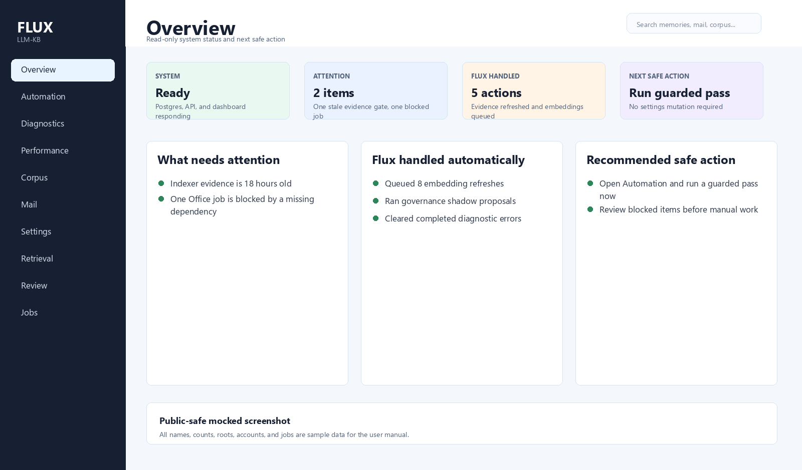

Overview is the starting point. It is intentionally simple and read-only.

Use it when you want to answer four questions quickly:

- Is Flux healthy enough to trust right now?
- What needs my attention?
- What did Flux already handle for me?
- What is the next safe thing I should do?

The Overview tab does not change settings, approve captures, delete anything, start host processes, open files, or run risky governance actions. If a task needs judgment, Overview points you to the correct tab.

Typical next actions:

- Go to Automation when the next safe action is to run a guarded pass.
- Go to Diagnostics when errors need inspection.
- Go to Performance when benchmark or reliability evidence is stale.
- Go to Review when capture decisions or governance decisions need a human.

## Automation

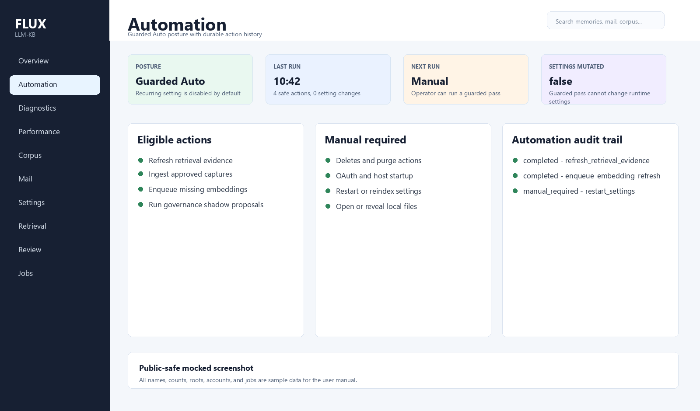

Automation shows what Flux is allowed to do without asking and what it refuses to do automatically.

Guarded Auto is conservative. By default, recurring automation is disabled under `operator.automation.*`, but an operator can still run a guarded pass manually from the dashboard, CLI, REST, or MCP. A guarded pass records every planned or executed action in durable history.

The Automation tab shows:

- Current posture, last run, next run, and whether recurring guarded passes are enabled.
- Eligible actions that can be run safely.
- Blocked or manual-required items that need a person.
- Audit trail with sanitized evidence, action status, trigger, dry-run state, and `settings_mutated: false`.
- A Run guarded pass now button for a bounded manual pass.

CLI examples:

```powershell
flux-kb automation status
flux-kb automation actions --limit 25
flux-kb automation run --mode guarded --limit 25
flux-kb automation run --dry-run --limit 10
```

REST examples:

```text
GET /api/automation/status
GET /api/automation/actions?limit=25
POST /api/automation/run
```

MCP tools:

```text
kb.automation_status
kb.automation_actions
kb.automation_run
```

## Diagnostics

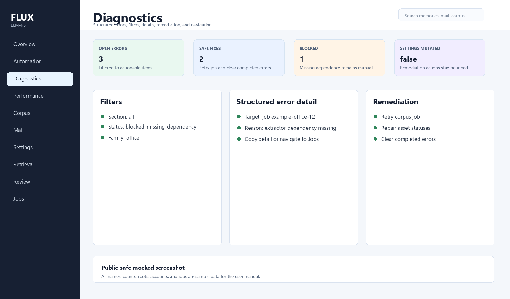

Diagnostics is where operational problems live. It is for practical repair, not general system summary.

Use Diagnostics to:

- Filter errors by area, root, status, or worker family.
- Read structured error details without private raw payloads.
- Copy useful diagnostic detail for support or a work note.
- Jump to the tab that owns the problem.
- Run safe remediation actions, such as retrying a failed job or clearing completed errors.

Diagnostics remediation is deliberately limited. It can run confirmation-worthy operational actions, but it does not mutate settings. Anything that would change restart or reindex behavior stays in Settings.

## Performance

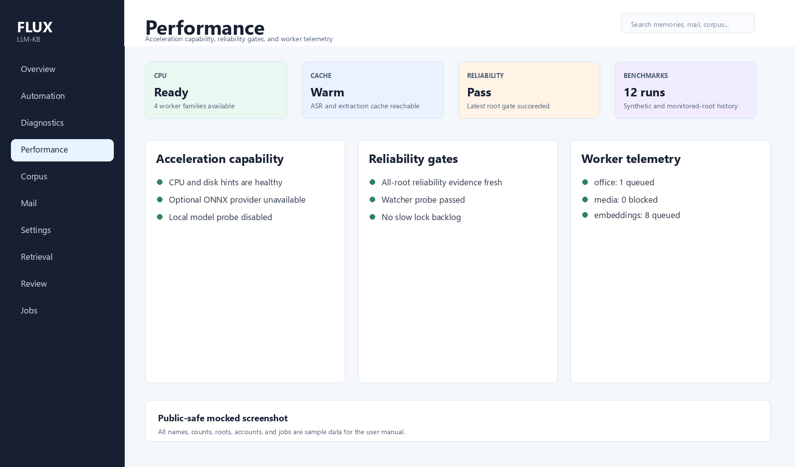

Performance explains whether Flux is ready to process local content efficiently and reliably.

Use Performance to inspect:

- Acceleration capability, including CPU, disk, cache, optional NVIDIA, optional ONNX, and local model readiness.
- Reliability gates for indexer behavior.
- Benchmark history for synthetic and monitored-root scenarios.
- Worker-family telemetry, backpressure, slow jobs, and retry or lock signals.
- Cache readiness for ASR, extraction, and benchmark evidence.

Performance answers "can Flux do this work well?" Diagnostics answers "what went wrong?"

## Corpus

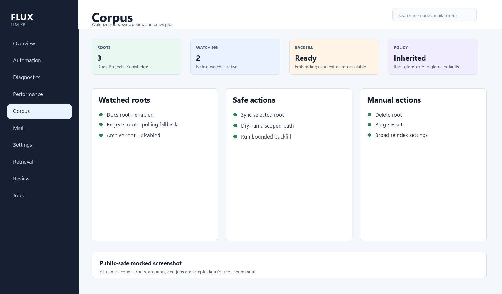

Corpus is where you manage watched local folders and files that Flux indexes.

Use Corpus to:

- Add a root folder with a friendly root name.
- Review include and exclude policy.
- Run a root sync or scoped path sync.
- Backfill extraction, embeddings, or other worker families.
- Enable or disable filesystem watching for a root.
- See crawl jobs and ingestion progress.

Deleting roots, purging assets, and broad rescans remain manual because they can remove or rewrite a lot of local evidence.

## Mail

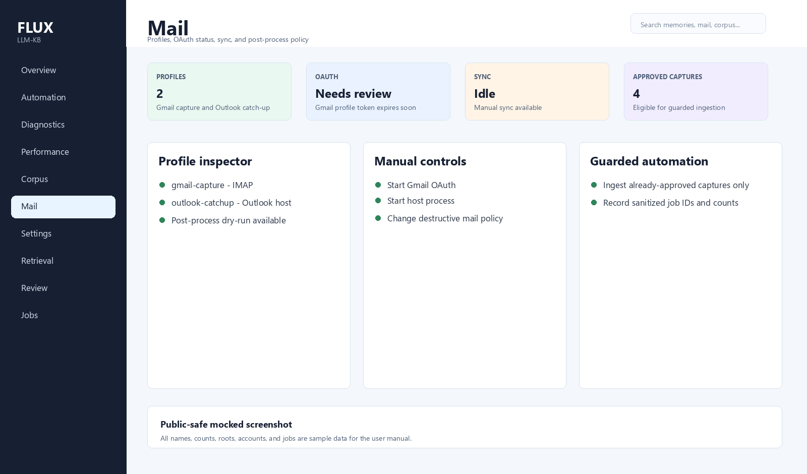

Mail is where you configure captured mail sources.

Use Mail to:

- Add IMAP or Outlook profiles.
- Check OAuth status for Gmail profiles.
- Run a sync for one selected profile.
- Inspect post-process policy dry-runs and events.
- See scheduler and host status.

OAuth setup, destructive mail policies, and host startup are manual. Flux can only ingest captures that are already approved by policy and review state.

## Retrieval

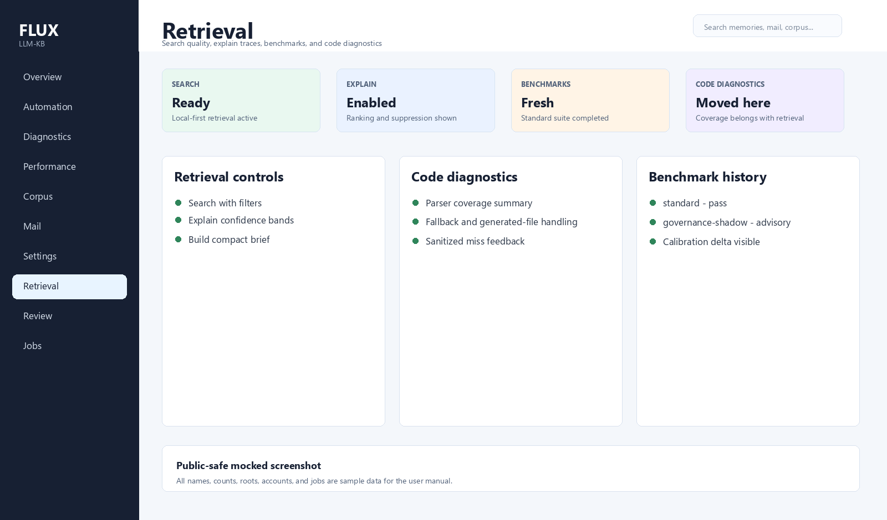

Retrieval is where you check answer quality and search behavior.

Use Retrieval to:

- Run search, explain, and brief workflows.
- Review filters, suppression, ranking signals, and confidence bands.
- Run retrieval benchmarks.
- Inspect retrieval benchmark history and calibration.
- Review code diagnostics and code-search quality controls.
- Record sanitized feedback when code search misses an expected symbol.

Code diagnostics moved here because code coverage, parser fallback, generated-file handling, and symbol lookup directly affect retrieval quality.

## Review

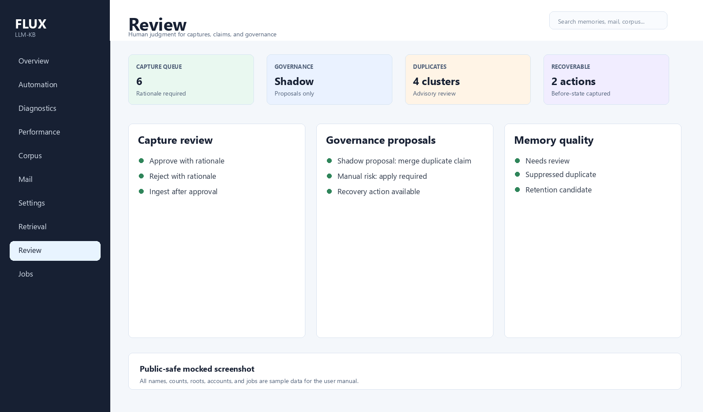

Review is where Flux asks for human judgment.

Use Review to:

- Approve or reject capture-review jobs with a rationale.
- Inspect claim lifecycle and memory quality candidates.
- Review governance proposals before applying them.
- Recover an applied governance action when needed.
- Review semantic duplicate advice.

Guarded automation may run governance in shadow mode to prepare proposals, but applying high-risk governance remains manual.

## Settings

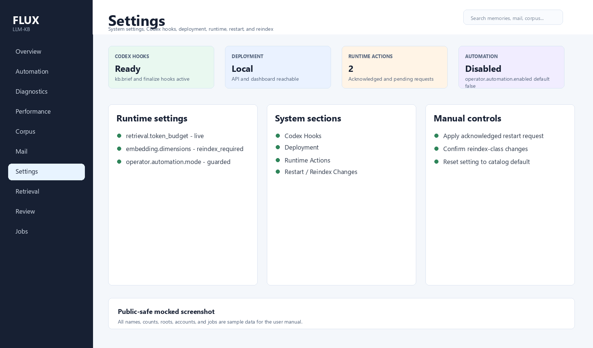

Settings is where operational configuration lives.

Use Settings to:

- Inspect effective runtime settings and their source.
- Edit live settings that do not require restart or reindex.
- Review restart-required and reindex-required setting changes.
- Apply acknowledged runtime requests.
- Check Codex hooks status.
- Check deployment status.
- See system-level runtime actions.

The `operator.automation.*` settings are disabled by default. Enable recurring guarded automation only after you are comfortable with the allowlist, audit trail, and manual-required list.

## Jobs

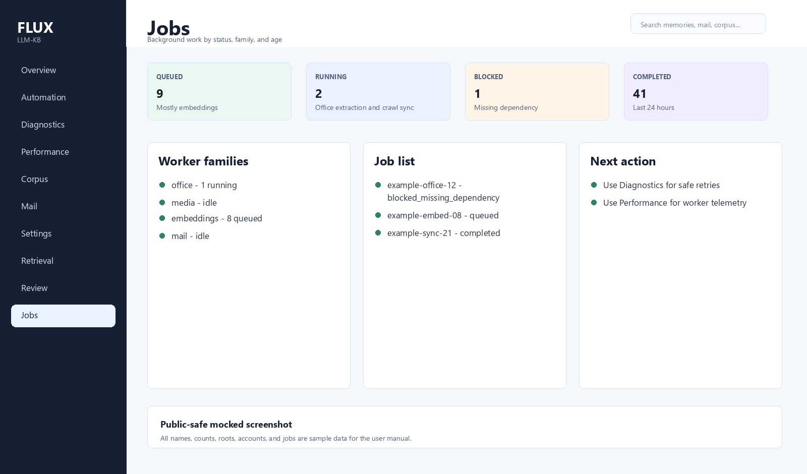

Jobs shows queued, running, completed, blocked, and failed background work.

Use Jobs to:

- See extraction, embedding, mail, and governance worker activity.
- Filter by status or family.
- Understand whether backpressure is building.
- Retry safe failed jobs through Diagnostics when appropriate.

Jobs is for visibility. Diagnostics is where repair actions live.

## Result Details

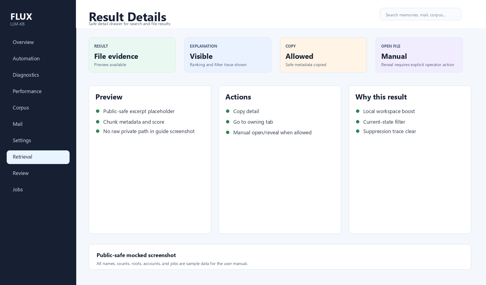

Result details open inside the dashboard when you select a search result or file result.

The detail view can show:

- Safe metadata.
- A text preview when available.
- Retrieval explanation.
- Copy actions.
- Navigation to the owning tab.

Opening or revealing a local file stays manual because it can expose private local paths or launch local applications.

## Operator Checklist

Use this short checklist during routine operation:

- Start on Overview.
- If Overview says Flux handled work automatically, check Automation audit history.
- If Overview says attention is needed, open Diagnostics.
- If evidence is stale, run a guarded pass or run Performance benchmarks.
- If capture or governance decisions are waiting, open Review.
- If runtime settings need a restart or reindex, handle them in Settings.

## Keeping This Manual Current

When dashboard UI, automation behavior, operator APIs, setup docs, or screenshots change, update this markdown source, regenerate DOCX/screenshots, and visually verify the rendered DOCX pages before closeout.

Use:

```powershell
.\scripts\docs\capture-dashboard-user-guide-screens.ps1
.\scripts\docs\build-dashboard-user-guide.ps1 -Render
```
